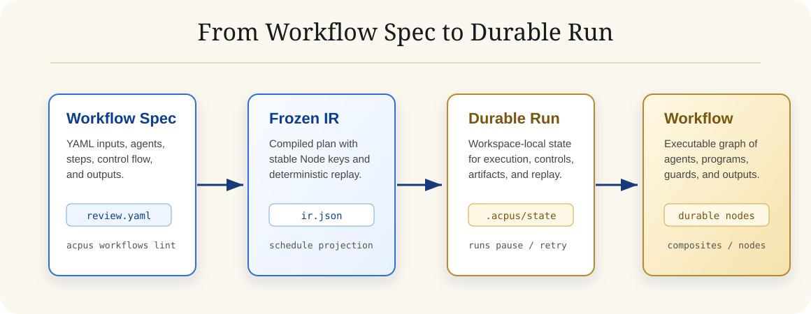
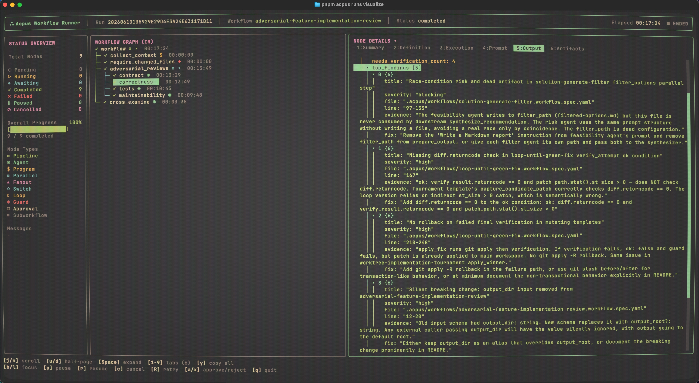

<p align="center">
  
</p>

<h1 align="center">Acpus</h1>
<p align="center"><em>Every run is an opus.</em></p>

<p align="center">
  <a href="https://www.npmjs.com/package/acpus"></a>
  <a href="https://github.com/kelvinschen/acpus/actions/workflows/publish.yml"></a>
  <a href="LICENSE"></a>
  
</p>

Acpus is a local durable workflow runner for ACP agents. You write a YAML Workflow Spec, Acpus validates and freezes it into an execution plan, then runs Agent Steps through [`acpx`](https://github.com/openclaw/acpx), Program Steps as local subprocesses, and records every Run under the current Workspace.

It is built for agent work that needs structure: fanout, loops, switches, human approvals, retry, replay, artifacts, and a terminal visualizer that can inspect and control a live Run.

<p align="center">
  
</p>

## Quick Start

> [!TIP]
> In case you don't want to install it manually, copy this prompt into your agent:
>
> ```text
> Read github.com/kelvinschen/acpus to understand Acpus. Follow the README to install the Acpus skill, then inspect the available Workflow Specs, choose or draft a workflow for my task, lint it, run it with Acpus, and report the Run status, artifacts, outputs, and useful next controls.
> ```

Install the CLI:

```sh
npm install -g acpus
```

Create a Workflow Spec:

```yaml
# review.workflow.yaml
version: 1
name: quick-review
input:
  topic: string
agents:
  reviewer:
    use: codex
workflow:
  steps:
    - id: review
      run: agent
      use: reviewer
      prompt: |
        Review this topic and return concise JSON:
        ${{ input.topic }}
      output:
        risk_count: integer
        ready: boolean
outputs:
  risk_count: ${{ steps.review.output.risk_count }}
  ready: ${{ steps.review.output.ready }}
```

Lint and preview it:

```sh
acpus workflows lint review.workflow.yaml
acpus workflows run review.workflow.yaml --dry-run
```

Run it:

```sh
acpus workflows run review.workflow.yaml --input '{"topic":"release readiness"}'
```

Open the terminal visualizer for the latest Runs:

```sh
acpus runs visualize
```

Serve a read-only browser visualizer from a remote devbox:

```sh
acpus runs visualize <runId> --serve 3000
```

The Served Visualizer binds to `127.0.0.1` by default and prints the local URL. Forward the port from your remote environment to view it locally; do not expose it to untrusted networks because it shows the same Run prompts, outputs, errors, and artifact paths as the terminal visualizer.

`acpus wf` is an exact alias for `acpus workflows`.

<p align="center">
  
  <br>
  <sup><em>Inspect a Run in Ghostty: status overview, Workflow graph, selected Node details, JSON output, artifacts, and control key hints.</em></sup>
</p>

## Use Acpus From Your Agent

Install the Acpus skill into any agent supported by the open `skills` CLI:

```sh
npx skills add kelvinschen/acpus --skill acpus
```

Then ask your preferred agent to design, lint, run, visualize, and control Acpus workflows for you. The skill gives the orchestrating agent a compact operating guide for `acpus workflows`, `acpus runs`, Workflow Specs, catalog playbooks, replay, retry, and human approval signals.

Acpus sits underneath that agent as the durable runner. Your agent can author a Workflow Spec, start a Run, and coordinate any worker agent supported by [`acpx`](https://github.com/openclaw/acpx), while Program Steps handle deterministic local commands such as git status, lint, build, test, and patch application.

## Workflows And Runs

Acpus separates workflow definition from execution state:

| Concept | Meaning |
| --- | --- |
| Workflow Spec | YAML file declaring inputs, agents, steps, control flow, and outputs. |
| Workflow Catalog | Discoverable specs under `.acpus/workflows/` or `$HOME/.acpus/workflows/`. |
| Run | One submitted execution with frozen input and a frozen workflow snapshot. |
| Node | A stable addressable unit inside a Run: Agent Step, Program Step, fanout, loop, switch, approval, and more. |
| Artifact | Durable files written under `.acpus/state/runs/<runId>/artifacts/`. |

Common commands:

```sh
# Workflow definition
acpus workflows list
acpus workflows show project:stress-demo
acpus workflows lint project:stress-demo
acpus workflows run project:stress-demo --dry-run

# Runtime execution
acpus workflows run review.workflow.yaml
acpus workflows run review.workflow.yaml --background
acpus workflows run review.workflow.yaml --visualize
acpus workflows run review.workflow.yaml --json
acpus workflows run review.workflow.yaml --agents '{"reviewer":{"type":"builtin","use":"claude","model":"opus"}}'

# Run inspection and control
acpus runs list
acpus runs show <runId>
acpus runs visualize <runId> --serve 3000
acpus runs pause <runId>
acpus runs resume <runId>
acpus runs cancel <runId>
acpus runs retry <runId>
acpus runs retry <runId> --node <nodeKey>
acpus runs signal <runId> --node <nodeKey> --approve
acpus runs replay <runId>
acpus runs fork <runId> review.workflow.yaml --dry-run
acpus runs fork <runId> review.workflow.yaml --from workflow/review
acpus runs clean --dry-run
```

Run-facing commands lazily start a Workspace-scoped local Run Supervisor. You do not start a daemon manually; the supervisor is discovered through `.acpus/state/supervisor.json` and exits after it becomes idle.

### Change Agents At Submit Time

Use `--agents` to temporarily run an existing Workflow Spec with different agents. Inline values should use JSON:

```sh
acpus workflows run review.workflow.yaml \
  --agents '{"reviewer":{"type":"builtin","use":"claude","model":"opus"}}'
```

Use a JSON file for larger maps: `acpus workflows run review.workflow.yaml --agents agents.json`.

### Fork A Run

Use `runs fork` to continue from a repaired Workflow Spec while reusing completed work:

```sh
acpus runs fork <sourceRunId> review.workflow.yaml --dry-run --json
```

Then create the Forked Run:

```sh
acpus runs fork <sourceRunId> review.workflow.yaml --from workflow/review
```


## Workflow Visualizer

Every workflow spec is rendered as an interactive digraph — click nodes to inspect agents, programs, guards, loops, and fanout bodies. Expand composite nodes to see inner steps.

→ [Browse all workflow specs on GitHub Pages](https://kelvinschen.github.io/acpus/workflows/)

## Agent Workflow Playbooks

The project catalog includes runnable playbooks for larger agent workflows. The playbooks are not the dynamic part by themselves; they are starting points your agent can inspect, adapt, and extend into task-specific Workflow Specs.

They keep agents responsible for judgment, synthesis, implementation, and repair, while Program Steps handle deterministic glue such as git status, worktree setup, lint, build, test, and patch application.

| Pattern | Workflow ref | Use case | Mutates workspace |
| --- | --- | --- | --- |
| Goal driven development | [`goal-driven-development`](https://github.com/kelvinschen/acpus/blob/main/.acpus/workflows/goal-driven-development.workflow.spec.yaml) | Decompose a goal into a frozen requirement checklist, then loop build-audit until every requirement is verified met or the budget is exhausted. | Yes |
| Fanout and synthesize | [`codebase-deep-research`](https://github.com/kelvinschen/acpus/blob/main/.acpus/workflows/codebase-deep-research.workflow.spec.yaml) | Run independent research agents and synthesize a final report. | No |
| Adversarial verification | [`adversarial-feature-implementation-review`](https://github.com/kelvinschen/acpus/blob/main/.acpus/workflows/adversarial-feature-implementation-review.workflow.spec.yaml) | Review a feature through contract, correctness, test, and maintainability lenses. | No |
| Generate and filter | [`solution-generate-filter`](https://github.com/kelvinschen/acpus/blob/main/.acpus/workflows/solution-generate-filter.workflow.spec.yaml) | Generate multiple solution directions, critique them, and rank a recommendation. | No |
| Tournament | [`worktree-implementation-tournament`](https://github.com/kelvinschen/acpus/blob/main/.acpus/workflows/worktree-implementation-tournament.workflow.spec.yaml) | Let multiple agents implement candidates in isolated worktrees and apply the winning patch. | Yes |
| Loop until done | [`loop-until-green-fix`](https://github.com/kelvinschen/acpus/blob/main/.acpus/workflows/loop-until-green-fix.workflow.spec.yaml) | Iterate agent repair attempts until verification passes, then apply the passing patch. | Yes |

Examples:

```sh
acpus workflows list
acpus workflows show project:codebase-deep-research
acpus workflows lint project:worktree-implementation-tournament
```

Mutating templates require a clean git workspace before they apply patches. They keep review material under `.acpus/output/...` so you can audit the generated work before cleanup.

## Workflow Spec Shape

A Workflow Spec can combine local programs, ACP agents, and control-flow Nodes:

```yaml
version: 1
name: release-check
input:
  target: string
agents:
  reviewer:
    use: codex
workflow:
  steps:
    - id: collect
      run: program
      cmd: ["git", "status", "--short"]
      capture:
        from: stdout
        parse: text

    - id: review
      run: agent
      use: reviewer
      prompt: |
        Review release target `${{ input.target }}`.
        Git status:
        ${{ steps.collect.output }}
      output:
        verdict: string
        notes:
          - text: string

    - id: require_ok
      guard:
        when: steps.review.output.verdict == "ok"
        then: continue
        else: fail
        message: "Release check did not pass"
```

Agent Steps run through [`acpx`](https://github.com/openclaw/acpx); Program Steps run as local subprocesses. Runs are local, single-host, durable, and replayable from their frozen snapshots.

## Packages

| Package | Purpose |
| --- | --- |
| `acpus` | User-facing CLI. |
| `@acpus/core` | Workflow parser, compiler, validation, diagnostics, and schedule projection. |
| `@acpus/runtime` | Local durable interpreter, Run Supervisor, state store, executors, artifacts, replay, and controls. |
| `@acpus/tui` | Terminal visualizer for Run inspection and control. |
| `@acpus/mock-agent` | Repository-local deterministic ACP-compatible test agent. Not published in the first public package set. |

## Development

```sh
pnpm install
pnpm build
pnpm typecheck
pnpm test
```

## Documentation

- [Specs Index](specs/INDEX.md)
- [Workflow Spec](specs/workflow-spec.md)
- [CLI Spec](specs/cli-spec.md)
- [Workflow Catalog Spec](specs/workflow-catalog-spec.md)
- [Local Runtime Target Spec](specs/local-runtime-target-spec.md)
- [Schema Spec](specs/schema-spec.md)
- [Mock Agent Spec](specs/mock-agent-spec.md)

Current design truth lives in `specs/`. Historical plans, validation records, and handoff notes live under `docs/archive/`.

## License

MIT
