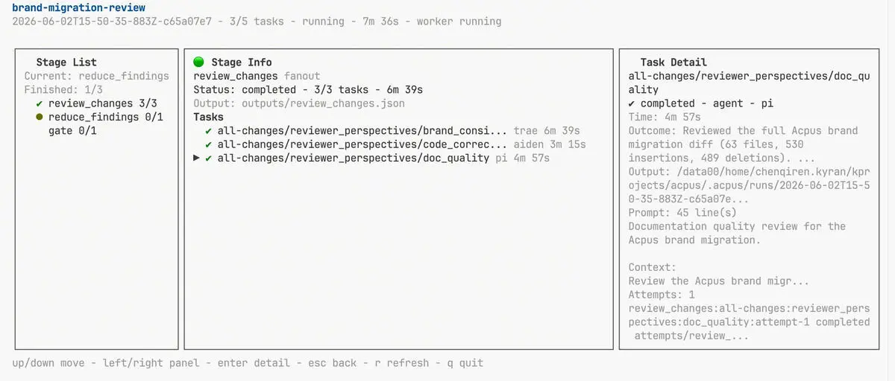

<p align="center">
  
</p>

<h1 align="center">Acpus</h1>
<p align="center" font-style="italic">Every run is an opus.</p>

<p align="center">
  <a href="https://www.npmjs.com/package/acpus"></a>
  <a href="https://github.com/kelvinschen/acpus/actions/workflows/publish.yml"></a>
  <a href="LICENSE"></a>
  
</p>

> [!WARNING]
> Acpus is currently in alpha. CLI/runtime interfaces will change frequently.

Acpus is a runtime-driven workflow orchestrator for ACP agents, built on the acpx agent runtime. You hand it a *workflow spec*; Acpus validates it, compiles a deterministic execution plan, conducts heterogeneous fanout across lanes, and tracks every run as a numbered, replayable execution, or say, an *opus*.

## Quick Start

```bash
npm install -g acpus

acpus plan workflows/examples/simple-feature.workflow.spec.yaml

acpus run workflows/examples/simple-feature.workflow.spec.yaml

acpus monitor
```

## Skill

```bash
npx skills add kelvinschen/acpus --skill acpus
```

## Commands

Acpus commands are grouped by workflow phase. Optional parameters are shown in brackets.

### Compose — plan, save

| Command | Options | Purpose |
|---|---|---|
| `acpus plan <spec>` | `--global`, `--quiet`, `--json` | Validate a spec file or saved workflow name and preview the compiled execution plan |
| `acpus save <name> <spec>` | `--overwrite`, `--global`, `--json` | Save a workflow spec to the workflow store |

`plan --json` emits a structured plan preview for automation. `save --json` emits `{ok, workflow, path}` so scripts can capture the saved workflow path.

### Conduct — run, follow, monitor, resume

| Command | Options | Purpose |
|---|---|---|
| `acpus run [spec]` | `--global`, `--input <json-or-yaml-or-path>`, `--wait`, `--json` | Prepare and start a workflow from a spec file or saved workflow name |
| `acpus follow [run]` | `--json` | Select or attach to a run and stream events in real time |
| `acpus monitor [run]` | `--json` | Select or open a run in the terminal UI, or print the monitor view as JSON |
| `acpus monitor detail <run> <task-id>` | `--json` | Show bounded detail for one stage task |
| `acpus resume <run>` | `--allow-partial-fanout <stage...>`, `--max-fanout-items <stage=count...>`, `--skip-fanout-item <stage=index...>`, `--force`, `--wait`, `--json` | Resume a blocked or failed run, or recover a stale running/pending run with `--force` |

`--input` accepts an inline JSON object or a JSON/YAML file path, for example `--input input.yaml`.

<figure align="center">
  
  <br>
  <sup><em>Real-time run inspection — stages, lanes, and the event stream at a glance.</em></sup>
</figure>

### Catalogue — list, show

| Command | Options | Purpose |
|---|---|---|
| `acpus list workflows` | `--global`, `--json` | List saved workflows |
| `acpus list runs` | `--json` | List project runs |
| `acpus show workflow <name>` | `--global`, `--json` | Display a saved workflow |
| `acpus show run <id>` | `--json` | Display a run by logical run id or run directory |

### Internal

| Command | Purpose |
|---|---|
| `acpus _run-worker <run>` | Hidden background worker entry point used by `run` and `resume`; not intended for direct use |

## Architecture

Acpus sits between the author and the acpx runtime. The main agent produces a *workflow spec*. Acpus reads it, validates it against the JSON schema, and compiles it into an *execution plan* — a deterministic sequence of stages, each containing parallel lanes that map to independent acpx sessions.

Run directories live under `.acpus/runs/<id>/`. Each contains:

- `workflow.spec.yaml` — the original workflow spec
- `execution-plan.json` — the compiled plan
- `input.json` — resolved inputs at launch time
- `outputs/` — stage outputs and final artefacts
- `attempts/` — raw attempt records with agent transcripts
- `acpx-state/` — run-local acpx session state
- `sessions/` — per-lane session logs
- `events.ndjson` — timestamped event log for the entire run

The orchestrator does not generate or execute ACPX flow files directly. It drives acpx through its runtime API.

## Documentation

- [Developer documentation](docs/README.md)
- [Design and implementation specifications](specs/INDEX.md)
- [CLI guide](docs/cli.md)
- [Error code guide](docs/error-codes.md)

## License

MIT
