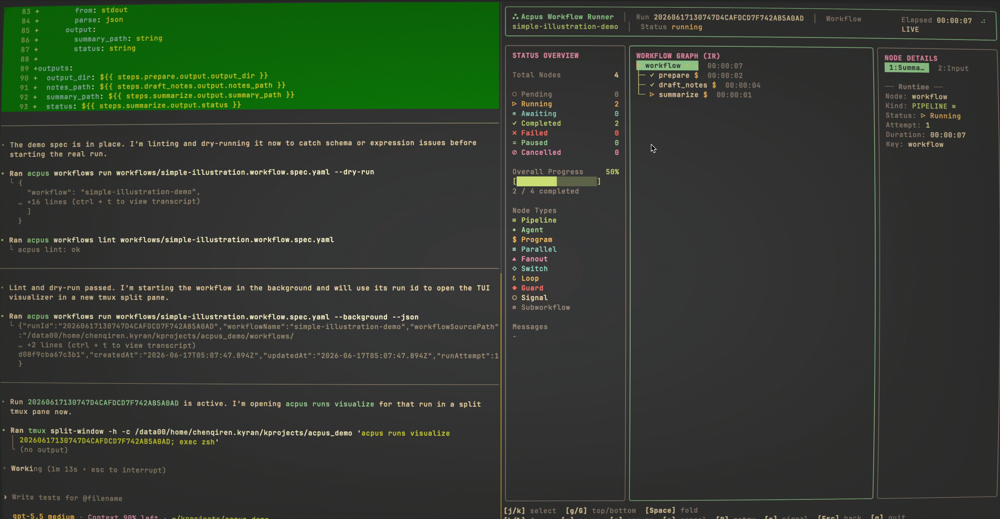

<p align="center">
  
</p>

<h1 align="center">Acpus</h1>
<p align="center"><em>Every run is an opus.</em></p>

<p align="center">
  <a href="https://www.npmjs.com/package/acpus"></a>
  <a href="https://github.com/kelvinschen/acpus/actions/workflows/publish.yml"></a>
  <a href="LICENSE"></a>
  
</p>

Acpus 是一个本地工作流 (workflow) 执行器。它把三种执行原语放在同等位置：**Agent**、**Program** 和 **Signal**，并允许你用可组合的控制流把它们编排成复杂且高效的工作流。

如果你了解 Claude Code 的 [dynamic workflows](https://claude.com/blog/a-harness-for-every-task-dynamic-workflows-in-claude-code)，可以把 Acpus 看作它的声明式对应：用 YAML spec 代替生成脚本，编排任意 [支持 ACP 协议的 agent](https://github.com/openclaw/acpx/tree/main/agents)（Codex、Pi、OpenCode、Claude Code 等）而非单一运行时，并通过 Signal 节点支持 human-in-the-loop。

## 设计

### 三种执行原语

| 原语 | 做什么 | 谁来执行 |
| --- | --- | --- |
| **Agent** (`run: agent`) | 通过 [`acpx`](https://github.com/openclaw/acpx) 调用 ACP-compatible agent，并要求结构化输出。 | Agent，适合开放式判断、综合、实现。 |
| **Program** (`run: program`) | 运行本地子进程并捕获输出。 | 机器，适合确定性的胶水逻辑：git status、lint、build、test、应用 patch。 |
| **Signal** (`run: signal`) | 让 Run 进入 `awaiting`，直到外部注入 JSON payload。 | 外部决策者，可以是审批变更的人，也可以是驱动 workflow 的 agent。 |

Signal Node 是统一的外部决策通道。同一个 `acpus runs signal` 机制既能处理 human-in-the-loop 审批，也能处理 agent 驱动的流程控制：一种模式，一套 CLI，不需要特例。

### 可组合的控制流

这些原语通过 **Composite Nodes** 和 **Guard Nodes** 编排：

| 元素 | 类型 | 做什么 |
| --- | --- | --- |
| Pipeline | 隐式 composite | 按顺序执行步骤；每一步的输出可供后续步骤使用。 |
| Parallel | composite | 并发运行具名分支，并用 `all` 或 `race` 汇合。 |
| Fanout | composite | 对动态列表中的每一项运行同一段 body，支持 `max_concurrency`、`join` 策略和 `success_criteria`。 |
| Loop | composite | 重复执行 body，直到条件满足，并用 `max_iterations` 作为安全上限。 |
| Switch | composite | 按顺序判断条件，选择一个分支执行。 |
| Guard | guard | 确定性的内联决策：根据条件 `continue`、`fail` 或 `complete` 当前 scope。 |
| Subworkflow | composite | 把另一个 Workflow Spec 作为子 scope 调用。 |

Composite nodes 可以任意嵌套。比如一个 fanout lane 里可以有 loop，loop 里可以有 parallel，parallel 里再包含 agent 和 program steps。Guard nodes 也可以出现在任意 scope：在 fanout lane 内只影响当前 lane；在 root 作用域则可以 fail 或 complete 整个 Run。

### 持久化可控制的运行

每个 Run 都是一份冻结快照：提交时会固定 input、workflow IR 和 agent definitions。Run 可以跨崩溃恢复，可以 pause/resume；失败的 node 可以单独 retry；完成的 Run 可以基于冻结 IR 只读 replay。Forked Run 会复用前一个 Run 已完成的工作，只重新执行发生变化的 node。

## 快速开始

> [!TIP]
> 你可以把下面这段 prompt 交给你的 agent，让它安装 Acpus skill，并解释 Acpus 能做什么：
>
> ```text
> 探索 github.com/kelvinschen/acpus，了解 Acpus 的工作方式，然后按照 README 安装 Acpus CLI 和 skill。安装完成后，向我解释 Acpus 能帮助我完成哪些类型的任务。
> ```

安装 CLI：

```sh
npm install -g acpus
```

为你的 agent 安装 Acpus skill：

```sh
npx skills add kelvinschen/acpus --skill acpus
```

创建一个 Workflow Spec：

```yaml
# review.workflow.yaml
version: 1
name: quick-review
input:
  topic: string
agents:
  reviewer:
    use: codex
workflow:
  steps:
    - id: review
      run: agent
      use: reviewer
      prompt: |
        Review this topic and return concise JSON:
        ${{ input.topic }}
      output:
        risk_count: integer
        ready: boolean
outputs:
  risk_count: ${{ steps.review.output.risk_count }}
  ready: ${{ steps.review.output.ready }}
```

先 lint，再运行：

```sh
acpus workflows lint review.workflow.yaml
acpus workflows run review.workflow.yaml --input '{"topic":"release readiness"}'
```

打开终端 TUI visualizer：

```sh
acpus runs visualize
```

> 如果你的 agent 运行在 tmux 里，它可以帮你 split 一个 pane 打开 tui，不需要你手动切窗口。

<p align="center">
  
  <br>
  <sup><em>在 TUI 中检查 Run：Status Overview、Workflow Graph、Node Details</em></sup>
</p>


### 常见用法

```sh
# Workflow definition
acpus workflows list
acpus workflows show project:codebase-deep-research
acpus workflows lint review.workflow.yaml
acpus workflows run review.workflow.yaml --dry-run

# Run with overrides
acpus workflows run review.workflow.yaml --input '{"topic":"release readiness"}'
acpus workflows run review.workflow.yaml --background
acpus workflows run review.workflow.yaml --visualize
acpus workflows run review.workflow.yaml --agents '{"reviewer":{"type":"builtin","use":"claude","model":"opus"}}'

# Run control
acpus runs list
acpus runs show <runId>
acpus runs visualize
acpus runs visualize <runId> --serve 3000
acpus runs pause <runId>
acpus runs resume <runId>
acpus runs cancel <runId>
acpus runs retry <runId>
acpus runs retry <runId> --node <nodeKey>
acpus runs signal <runId> --node <nodeKey> --payload '{"approved":true,"notes":"ship it"}'

# Fork and replay
acpus runs fork <runId> review.workflow.yaml --dry-run
acpus runs fork <runId> review.workflow.yaml --from workflow/review
acpus runs replay <runId>
```

`acpus wf` 是 `acpus workflows` 的别名。

## Hooks

Hooks 是位于 Workflow Specs 之外的 **runtime platform layer**，不会被冻结进 IR。它允许平台操作者在执行前注入上下文（**Injectors**），并观察 Run 与 Node 的生命周期（**Events**），而不需要修改 workflow 定义。

→ [Hooks Reference](skills/acpus/references/hooks-config.md) — 配置、协议、CLI 命令和 journal 的完整参考。

## 核心概念

### Workflows 和 Runs

| 概念 | 含义 |
| --- | --- |
| Workflow Spec | YAML 文件，声明 inputs、agents、steps、control flow 和 outputs。 |
| Workflow Catalog | 位于 `.acpus/workflows/` 或 `$HOME/.acpus/workflows/` 下的可发现 specs。 |
| Run | 一次已提交的执行，带有冻结的 input 和 workflow snapshot。 |
| Node | Run 中可稳定寻址的单元：Agent Step、Program Step、Signal Node、Composite Node 或 Guard Node。 |
| Artifact | 写入 `.acpus/state/runs/<runId>/artifacts/` 的持久化文件。 |


### Catalog Playbooks

项目 catalog 内置了一些可直接运行的 playbooks，覆盖常见 agent workflow 模式：goal-driven development、fanout-and-synthesize、adversarial review、tournament implementation 等。用 `acpus workflows list` 查看列表，用 `acpus workflows show` 查看详情。

### 可视化 Workflow Spec

你的 agent 可以通过 Acpus skill 为 Workflow Specs 和 Runs 生成交互式可视化页面。

→ [在 GitHub Pages 浏览生成的 workflow spec visualizations](https://kelvinschen.github.io/acpus/workflows/)

## 延伸阅读

- [Dynamic Workflows in Claude Code](https://claude.com/blog/a-harness-for-every-task-dynamic-workflows-in-claude-code) — Acpus 的设计灵感来源于这篇关于多 agent 编排模式（fan-out、adversarial verify、tournament、loop-until-done）的文章。

## 文档

### References
- [Workflow Spec Schema Reference](skills/acpus/references/workflow-spec-schema.md) — 面向 AI agents 的紧凑全 schema 参考

### Specs
- [Specs Index](specs/INDEX.md)
- [Workflow Spec](specs/workflow-spec.md)
- [Hooks Spec](specs/hooks-spec.md)
- [CLI Spec](specs/cli-spec.md)
- [Workflow Catalog Spec](specs/workflow-catalog-spec.md)
- [Local Runtime Target Spec](specs/local-runtime-target-spec.md)
- [Schema Spec](specs/schema-spec.md)
- [Mock Agent Spec](specs/mock-agent-spec.md)

当前设计事实以 `specs/` 为准。历史计划、验证记录和 handoff notes 放在 `docs/archive/`。

## 开发

```sh
pnpm install
pnpm build
pnpm typecheck
pnpm test
```

## License

MIT
