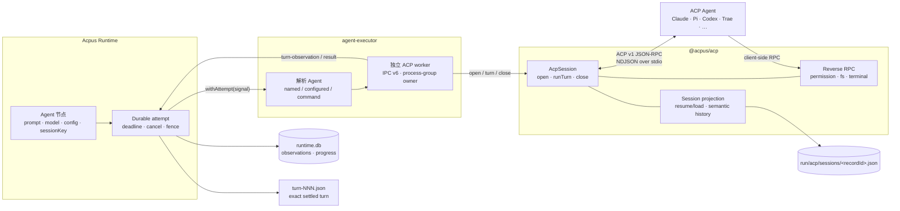
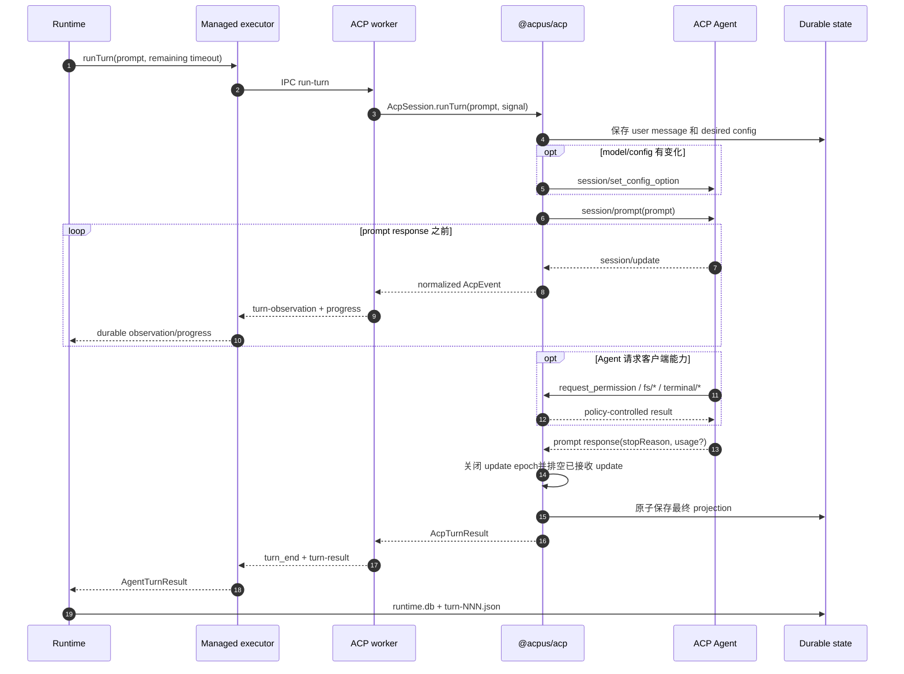
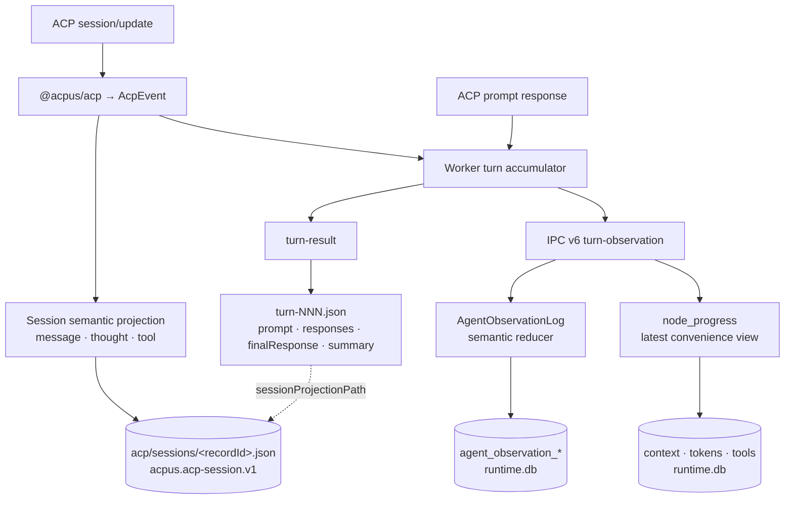

# Acpus ACP Session Runtime

本文说明 Acpus 如何启动、运行、恢复和关闭一个 ACP 会话，重点描述
Runtime、`agent-executor`、`@acpus/acp` 与 ACP Agent 之间的协作边界。

这是一份实现导览，不是协议或产品契约。稳定行为以
[`acp-spec.md`](../specs/acp-spec.md)、
[`agent-executor-spec.md`](../specs/agent-executor-spec.md) 和
[`runtime-spec.md`](../specs/runtime-spec.md) 为准。

## 整体结构



每一层只拥有自己能够权威决定的状态：

| 层 | 所有权 | 不负责 |
| --- | --- | --- |
| Runtime | Durable attempt、authored deadline、取消和 fence、observation、artifact | ACP wire 细节和 provider 进程 |
| `agent-executor` | Agent 启动项解析、每个 attempt 的 worker、IPC、进程树清理 | ACP session 状态机 |
| `@acpus/acp` | ACP initialize/session/prompt/update、恢复、配置、reverse RPC、projection | Named Agent 目录和 durable scheduling |
| ACP Agent | 模型推理、工具行为、provider session 和声明的协议能力 | Acpus 的持久化与 attempt 生命周期 |

`@acpus/acp` 内部使用官方 `@agentclientprotocol/sdk` 处理 ACP v1 的
JSON-RPC/NDJSON 编解码，但对外只暴露 Acpus 自己拥有的类型。公开可调用面只有：

```ts
openAcpSession(input)
session.runTurn(input)
session.close(reason?)
```

## 从 Agent 节点到 ACP 会话

```text
executeAgentNode
  resolve Agent definition / cwd / env / model
  resolve stable run-local sessionName
  managedAcpExecutor.withAttempt(signal)
    resolve named/configured/command launch
    spawn isolated worker
      IPC: open-started
      openAcpSession
        load session projection
        spawn ACP Agent
        initialize
        session/new | session/resume | session/load
        replay desired configuration
        atomically persist projection
      IPC: ready
    attempt.runTurn(...)
```

一次完整启动的消息顺序如下：

```mermaid
sequenceDiagram
    autonumber
    participant R as Runtime attempt
    participant E as Managed executor
    participant W as ACP worker
    participant C as @acpus/acp
    participant A as ACP Agent
    participant D as Run-local state

    R->>E: withAttempt(signal, deadline, agent)
    E->>E: 解析 named/configured/command launch
    E->>W: spawn + IPC initialize
    W-->>E: open-started

    Note over E,W: 5 秒只约束 worker bootstrap

    W->>C: openAcpSession(recordId, cwd, launch, signal)
    C->>D: 读取 sessions/&lt;recordId&gt;.json
    C->>A: spawn ACP server
    C->>A: initialize(protocolVersion, clientCapabilities)

    alt 没有历史 projection
        C->>A: session/new(cwd)
        A-->>C: backend sessionId + capabilities
    else Agent 支持 resume
        C->>A: session/resume(sessionId, cwd)
    else Agent 只支持 load
        C->>A: session/load(sessionId, cwd)
    end

    opt 恢复了历史配置
        C->>A: session/set_config_option × N
    end

    C->>D: temporary write + atomic rename
    C-->>W: AcpSession ready
    W-->>E: ready
    E-->>R: attempt.runTurn 可用
```

### 两阶段 ready

Worker IPC 区分两个阶段：

```text
open-started
  worker 进程已经启动并开始 open

ready
  initialize 和 session/new|resume|load 已完成
  projection 已经原子落盘
  session 可以接收 turn
```

5 秒 bootstrap watchdog 只等待 `open-started`。完整 ACP open 不带 SDK
私有的固定 deadline；Runtime 从 durable attempt 开始计算的 authored deadline
通过同一个 `AbortSignal` 覆盖 Agent 解析、session open 和 turn。这样首次启动需要
下载 adapter，或者 Agent 初始化本来就较慢时，不会被误判为 worker 启动失败。

## 会话身份与恢复

Acpus 使用三层不同的身份：

| 身份 | 例子 | 用途 |
| --- | --- | --- |
| Authored `sessionKey` | `fix-review:fixer` | 声明哪些 Agent occurrence 共享对话 |
| Acpus `sessionName` / `recordId` | `acpus-Mw48dJv...` | Run-local 稳定存储身份 |
| Provider `sessionId` | Agent 返回的 UUID | ACP Agent 自己的会话身份 |

身份生成规则可以简化为：

```text
没有 sessionKey
  sessionName = hash({ runId, nodeKey })

存在 sessionKey
  sessionName = hash({ runId, sessionKey })

recordId = sessionName
projection.backend.sessionId = provider sessionId
```

会话连续性不要求复用常驻 worker。新的 attempt 可以启动全新的 worker 和
provider 进程，然后读取相同 projection：

```text
load projection
  initialize new provider process
  if Agent supports resume
    session/resume(saved sessionId)
  else if Agent supports load
    session/load(saved sessionId)
  else
    fail with a capability error
  replay desired model/config
  continue runTurn
```

因此，response repair 可以留在同一个 attempt 和 ACP session 中；retry 或
steering 即使更换 worker，也能恢复同一个 run-local session。未声明 `sessionKey`
的不同节点默认不会共享上下文。

## 一个 turn 内的 ACP 协作



### `session/update` fence

ACP v1 的 `session/update` 不带 turn ID。`@acpus/acp` 因而用对应
`session/prompt` request/response 的协议边界来限定 update：

```text
begin turn epoch
  写出 session/prompt，记录 JSON-RPC request id
  接收相同 sessionId 的 session/update
    message / thought
    tool call / tool update
    usage / context
    plan / session metadata
  读到匹配 request id 的 prompt response
    立即停止接收该 epoch 的新 update
    drain 已进入 handler 的 update
    再结算 turn
```

这避免使用任意 quiet timeout，也阻止 response 之后的 update 泄漏到下一个
turn。如果一个违规 Agent 在下一次 prompt 已写出后才发送上一个 turn 的旧
update，ACP v1 wire 上无法可靠区分；客户端不会用猜测性等待伪装解决这个协议限制。

### Agent 到客户端的 reverse RPC

ACP Agent 可以反向请求 Acpus 提供的客户端能力：

```text
ACP Agent
├── session/request_permission
│   └── approve-all / approve-reads / deny-all
├── fs/read_text_file
├── fs/write_text_file
│   └── 只能访问 canonical session cwd 内的路径
└── terminal/*
    ├── create
    ├── output / wait_for_exit
    └── kill / release
```

每个 reverse request 都必须命中当前 `sessionId` 并通过 permission policy。
Filesystem 操作使用 canonical containment、pinned parent 和 no-follow 检查；
terminal 输出有界，session 关闭后拒绝新的 reverse RPC，并排空已经准入的
terminal create 后再清理全部子进程。

## Observation 与审计记录

`session/update` 进入 `@acpus/acp` 后被归一化为 package-owned
`AcpEvent`，再分成两条用途不同的数据流：



### Session projection

物理位置为：

```text
<run-root>/acp/sessions/<percent-encoded-record-id>.json
```

文件 schema 是 `acpus.acp-session.v1`，包含：

- Acpus `recordId`、`cwd` 和不可逆 launch identity；
- provider `sessionId` 与 `resume`/`load` 能力；
- 期望 model/config，用于恢复后重放；
- 有界的 user/assistant/thought/tool 语义对话；
- 最近 stop reason 和 provider prompt response 提供的 token usage；
- 创建与更新时间。

Projection 是 session-wide、replace-in-place 的语义记录，不是原始 ACP 流。
它使用 `0600` 临时文件和同目录 atomic rename；conversation 只保留最新后缀，
上限为 256 entries 和 256 KiB。

### Durable observation

实时事件通过 worker IPC 进入 Runtime：

```text
AcpEvent
  → turn accumulator
  → turn-observation
  → AgentObservationLog
  → agent_observation_* tables
  → Summary / Timeline / agent execution inspection
```

Provider 发出 `usage_update` 时，Acpus 可以记录：

- context window `used` / `size`；
- input/output/cache/thought/total token usage；
- 最新 response、tool 状态与 ACP activity 时间。

没有提供 telemetry 的 Agent 会显式显示 `unavailable`，而不是用零值假装可用。

### Settled-turn artifact

每个已结算 turn 生成 `turn-NNN.json`，保存精确 prompt、按顺序的 response
segments、completed-only `finalResponse`、timing、summary 和最终状态。它只通过
顶层 `sessionProjectionPath` 引用 session projection，不复制 session conversation。

三类 durable 数据的职责如下：

| 数据 | 用途 | 是否保存原始 ACP wire |
| --- | --- | --- |
| `acp/sessions/<recordId>.json` | 恢复与低频会话审计 | 否，保存有界语义 projection |
| `runtime.db` observation/progress | 实时和历史 inspection | 否，保存语义 reduction |
| `turn-NNN.json` | 精确 settled-turn 记录 | 否，保存规范化 prompt/response/result |

原始 ACP NDJSON 不持久化。这样 durable 数据不会被某个 Agent 的私有 `_meta`、
SDK 对象结构或大量原始工具输出绑定。

## 取消、关闭和进程所有权

```text
durable attempt abort
  → executor IPC abort-turn
    → worker-local AbortController.abort()
      → @acpus/acp session/cancel
        → cancel pending permission requests
        → settle cancel notification and admitted updates
        → persist cancelled projection

attempt close
  → abort an active turn
  → session/close, when advertised by the Agent
  → close reverse-RPC admission
  → drain terminal creation and terminate terminals
  → close ACP connection
  → TERM, then KILL provider/process group when needed
```

一个 managed attempt 拥有一棵独立 worker 进程树。Worker 是 process-group
owner，provider 和 reverse-RPC terminal 通过内部继承令牌加入正确的 ownership
边界；令牌不会传给 provider 或 terminal 的业务环境。正常结算、取消、Runtime
shutdown 和异常退出最终都由 executor 清理 ownership manifest 和残留进程。

`AcpSession.close()` 是幂等操作。它先永久关闭新操作的准入，再尝试协议级
协作关闭，最后执行本地资源和进程清理；协议错误不能跳过清理。

## 代码导航

| 关注点 | 入口 |
| --- | --- |
| Run-local session identity | [`agent-session.ts`](../packages/runtime/src/execution/agent-session.ts) |
| Runtime Agent dispatch 与 turn artifact | [`agent-node.ts`](../packages/runtime/src/execution/agent-node.ts) |
| Workspace executor 与 run-local ACP 根目录 | [`workspace-runtime.ts`](../packages/runtime/src/workspace-runtime.ts) |
| Named/configured Agent 解析 | [`agent-resolution.ts`](../packages/agent-executor/src/agent-resolution.ts) |
| Worker 生命周期、IPC、timeout 与进程树 | [`managed-executor.ts`](../packages/agent-executor/src/managed-executor.ts) |
| Worker 到 `@acpus/acp` 的桥接 | [`worker-entry.ts`](../packages/agent-executor/src/worker-entry.ts) |
| IPC v6 closed message shapes | [`worker-protocol.ts`](../packages/agent-executor/src/worker-protocol.ts) |
| ACP session 状态机与 update fence | [`session.ts`](../packages/acp/src/session.ts) |
| Reverse permission/fs/terminal RPC | [`reverse-rpc.ts`](../packages/acp/src/reverse-rpc.ts) |
| Session projection schema 与安全写入 | [`persistence.ts`](../packages/acp/src/persistence.ts) |
| Public `@acpus/acp` types | [`types.ts`](../packages/acp/src/types.ts) |
| ACP event 到 Runtime observation | [`runtime-event.ts`](../packages/agent-executor/src/runtime-event.ts) |
| Durable semantic observation log | [`log.ts`](../packages/runtime/src/observations/log.ts) |
| Inspection projection | [`agent-execution-projection.ts`](../packages/runtime/src/inspection/agent-execution-projection.ts) |

