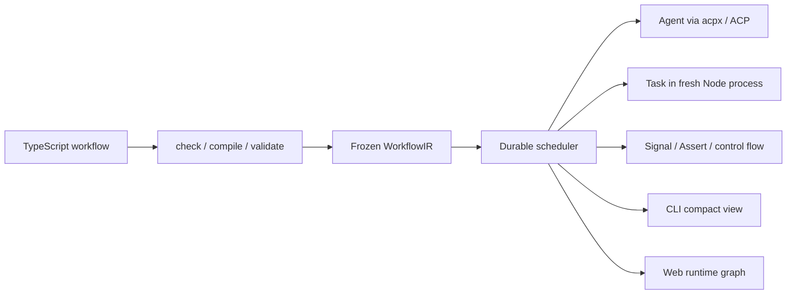
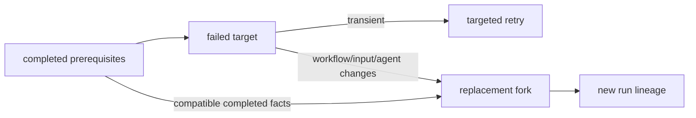

# Acpus Next：把 AI 工作流变成可检查、可观察、可恢复的工程资产

> 研究基线：2026-07-12。本文所称 **Acpus Next** 是当前仓库中的 TypeScript-first 重写版本；截至本文写作时，仓库仍标注为 foundation rewrite / alpha。本文所称 **Previous** 是 `legacy/` 中保留的已发布 YAML Workflow-Spec 版本。两者不是兼容层上的小升级，而是工作流编程模型的重做。

## 一句话认识 Acpus Next

Acpus Next 是一个本地、持久化、面向 AI 的工作流 harness：用户用 TypeScript 描述工作流图，用 Expression System 描述运行时值流；Acpus 在执行前把它检查并降低为冻结、可序列化的 `WorkflowIR`，再由持久化运行时调度 Agent、Task 与 Signal。

它要解决的不是“怎样多开几个 agent”，而是一个更工程化的问题：

> 当 AI 工作跨越多个 agent、多个小时、失败与人工介入时，如何让计划在执行前可理解、执行中可观察、失败后可恢复，并让已完成工作在安全边界内被复用？



## 核心设计：定义结构可静态降低，值与动态实例在运行时流动

普通 TypeScript 程序一边执行一边决定下一条语句；Acpus workflow 的 `build` 回调则在 run 开始前执行，用来“建图”。因此，`input`、`meta` 和节点 `output` 不是当下已有的普通 JavaScript 值，而是 `Expr<T>`：它们表示“运行时会得到一个 `T`”。

这条边界带来两个结果：

1. 节点、依赖、分支结构和运行边界可以在执行前被检查、冻结和可视化。
2. 运行时值不能直接进入作者期 JavaScript 的 `if`、`&&`、字符串拼接或算术；它们必须通过图节点、谓词、模板或 `lift` 进入值流。

### 为什么这里会提到函数式编程与 Functor

函数式编程强调用小而可组合的函数变换数据，并把“值本身”和“值所在的上下文”分开。一个常见抽象是 Functor：如果有某种上下文 `F<A>`，就能把普通函数 `A → B` 映射到该上下文中，得到 `F<B>`。

```text
map  : (A → B) → F<A> → F<B>
lift : Expr<A> → (A → B) → Expr<B>
```

直觉上：

| 上下文 | 里面的值何时可用 | 映射方式 |
| --- | --- | --- |
| `Array<A>` | 数组已经存在 | `array.map(fn)` |
| `Promise<A>` | 异步完成后 | `promise.then(fn)` |
| `Expr<A>` | workflow 运行时 | `lift(expr, fn)` |

Acpus 文档因此建议“把 `Expr` 想成 Functor”。这是帮助理解的类比，不是在宣称一套 Haskell typeclass 实现。`lift` 会把一到三个显式依赖与一个同步函数降低为 Expression IR；回调不能偷偷捕获 workflow 外部值，输出必须是 JSON-compatible data。

```ts
const reviewView = lift(review.output, output => ({
  route: output.route,
  priority: output.priority,
  summary: output.summary.trim(),
}));
```

这里有一个重要边界：`lift` 只是值变换，不是可独立寻址、重试、产出 artifact 的执行节点。需要独立观测、重试、依赖或 artifact 的本地计算，应建模为 `Task`；开放式判断交给 `Agent`。`Task` 是可信执行边界，不是纯函数或确定性保证：它可以访问文件、环境与系统 API，副作用和 fork 复用安全仍需作者审查。

| 选择 | 适合什么 | 是否是独立节点 | 运行边界 |
| --- | --- | --- | --- |
| `lift` | 小型同步 JSON 变换、派生条件 | 否 | Expression evaluator |
| `Task` | 文件、命令、依赖、artifact、需独立观测或重试的本地工作 | 是 | 每次 attempt 一个 fresh Node process |
| `Agent` | 判断、研究、实现、综合 | 是 | 通过 acpx 调用 ACP agent |

## TypeScript authoring 长什么样

下面的片段来自当前官方 `issue-triage` 示例。它同时展示了 Task、Agent、fanout、parallel 与 `lift`：

```ts
const triaged = step("triage_issues").fanout({
  over: input.issues,
  maxConcurrency: 3,
  do({ item }) {
    const lane = step("triage_lane").parallel({
      branches: {
        metadata() {
          const metadata = step("summarize_issue").task({
            task: summarizeIssue,
            input: { id: item.id, title: item.title, labels: item.labels },
            cwd: input.repoPath,
          });
          return metadata.output;
        },
        review() {
          const review = step("review_issue").agent({
            agent: agents.triager,
            cwd: input.repoPath,
            outputSchema: z.object({
              route: z.enum(["now", "later", "escalate"]),
              priority: z.number(),
              summary: z.string(),
            }),
            prompt: md`Triage ${item.title}: ${item.body}`,
          });
          const view = lift(review.output, output => ({
            ...output,
            summary: output.summary.trim(),
          }));
          return view;
        },
      },
    });
    return { id: item.id, lane: lane.output };
  },
});
```

对作者而言，TypeScript 带来的价值不只是补全：`workflow check` 会依次覆盖 TypeScript 诊断、Acpus authoring rules、模块编译和冻结 IR 结构验证。典型错误——把 `Expr` 当布尔值、在 `lift` 中捕获外部依赖、使用动态节点 id、让 inline Task 捕获模块变量——能在 run admission 之前暴露。

## 用户能得到什么

### 1. 执行前：一张可审查的图

TypeScript 模块可以被确定性地降低为冻结 `WorkflowIR`。`acpus workflow check` 在内存中完成检查与准备，不创建 run；`acpus workflow viz` 可生成自包含的静态 HTML 图。静态视图保留完整 canonical authored structure 与 composite 结构，而不是等运行后再从日志猜测流程；具体 fanout item 与 loop iteration 仍在运行时实例化。

这使 code review 可以同时回答两类问题：

- 代码是否类型正确、值流是否合法？
- workflow 的节点、分支、并发与人工介入位置是否设计合理？

### 2. 执行中：Web 图与紧凑 CLI 是同一份 durable state 的两种投影

本地 Web operator console 展示完整 canonical graph，并叠加 queued、running、awaiting、paused、completed、failed、canceled、skipped 等状态。fanout item 与 loop iteration 可选择，下钻 inspector 可查看 prompt、input、output、attempt、artifact 与 Agent execution telemetry。

CLI 面向人和 AI 提供更紧凑的同一事实面：

- authored structural tree，而不是原始 SQLite 表或事件洪流；
- 默认只展开有限的动态上下文，并保留精确 omitted counts；
- `--follow` 输出增量变化，而不是重复打印整棵树；
- Agent 节点显示 `Last active`、context/token counters 与最多三个 intent-only Last Tool Calls；
- `--json` / NDJSON 保留稳定 key、cursor、稀疏 patch 和事件顺序，供程序或 agent 精确消费。

### 3. Agent 可替换：workflow 不绑定单一模型产品

Acpus 通过 acpx 的 ACP 边界运行 Agent。当前内置命名 agent 包括 `codex`、`claude`、`pi`、`trae`、`opencode`、`gemini`、`cursor`、`copilot`、`qwen` 等；本地 acpx 配置还可增加命名 agent，或在没有命名适配时使用 raw ACP command。

因此，workflow 可以把“谁来执行”保留为可替换配置，而把图、数据流、恢复语义和观测面保持稳定。

### 4. durable control：暂停、重试、修复后 fork

Acpus 的 run 由 workspace-local SQLite 与冻结 run files 持有，CLI/Web 只是控制与观察客户端。



- `pause` 写入 durable pause gate，并 best-effort 中止活动 attempt；`resume` 清除 gate 并重新驱动可运行工作。
- `retry` 可针对整个失败 run、动态 leaf `nodeKey` 或 composite/control `frameKey`。
- `fork` 创建新的 run，可替换 workflow、input 或 agent mapping。
- targeted replacement fork 会在兼容性和依赖闭包边界内复用 scheduler 已接受的 completed facts，包括 Agent 或 Task 节点结果；它不是一个忽略输入与副作用的全局缓存。
- 输入或语义签名变化时默认不做不安全复用；`--unsafe-reuse` 是显式危险选项。
- `Signal` 是持久化的外部输入节点，可用于人工审批或外部控制者注入结构化决策。

### 5. runtime hooks：在不污染 workflow 的前提下观察生命周期

项目级 `.acpus/hooks.json` 与用户级 `$HOME/.acpus/hooks.json` 可以监听 run/node 的 started、completed、failed、canceled、awaiting 等 durable events，执行 shell command，并把 terminal history 写入独立 journal。

当前 Next hooks 是非干扰式 observer：失败或超时不能改变 workflow 状态、输出或 IR；它也不包含 Previous 版本的 injector 能力。这个约束让 hooks 更像可靠的平台集成层，而不是隐藏在 workflow 外的第二套控制流。

## AI-oriented 不只是“附带一份文档”

Acpus Next 的 AI-oriented 设计分布在三个 surface：

1. **Authoring surface**：窄而明确的 public facade、类型系统、稳定 diagnostics、按 Pattern/Nodes 标注的示例，以及把常见错误写成禁止项的 skill。
2. **Operating surface**：compact text tree、incremental follow、copyable recovery commands、Last Active、intent-only tool calls、bounded output。
3. **API surface**：默认返回 normalized compact projection；只有显式 target/raw 查询才扩大数据范围，减少 agent 在海量内部状态中迷路。

当前 Acpus skill 还经过了一轮专门的 agent eval：

| 维度 | 规模 |
| --- | ---: |
| workflow goals | 30 |
| models | 3（gpt-5.5 / gpt-5.4 / gpt-5.4-mini） |
| blank-agent runs | 90 |
| 评估类别 | API ergonomics / skill gap / runtime error / runtime bug |

评估不是一个“准确率分数”。它保存了每轮 workflow、输入、trace、run state 与 agent debrief，把重复失败模式回写到 skill，同时把不应靠堆文档掩盖的问题保留为 API/runtime 待办。换句话说，skill 被当作产品接口来测试，而不是一次性写完的 README。

## 五种方案的总览

| 维度 | Acpus Next | Previous Acpus | Claude Dynamic Workflows | Pi Dynamic Workflows | Dagu |
| --- | --- | --- | --- | --- | --- |
| 核心定位 | AI-first durable workflow programming model | YAML durable ACP workflow | Claude 原生即时 multi-agent harness | Pi 扩展中的轻量动态 fan-out prototype | 通用、本地优先的运维工作流引擎 |
| Authoring | TypeScript + typed `Expr` / `lift` | YAML + 字符串 expression | plain JS + workflow primitives | plain JS + workflow primitives | YAML + scoped interpolation / actions |
| authored structure 能否提前降低 | 可以；完整 canonical authored structure 可检查和可视化，fanout item / loop iteration 在运行时实例化 | 可以；声明结构可冻结，动态实例在运行时展开 | 一般不能；任意 JS 决定后续调用 | 不能；实际 phase/agent 运行时出现 | 可以；声明 DAG 可提前解析，runtime foreach / parallel 实例在运行时展开 |
| 一等执行单元 | Agent / Task / Signal / Assert + composites | Agent / Program / Signal / Guard + composites | `agent()`；JS 是协调层 | `agent()`；JS 是协调层 | 统一 Step + 多种 action/executor |
| 运行时可视化 | Web canonical graph + inspector；CLI tree | TUI / served visualizer | phase/agent progress TUI/Desktop | Pi TUI phase/agent list | Web graph + timeline + logs/artifacts |
| Agent 生态 | acpx / ACP，多 provider | acpx / ACP，多 provider | Claude Code subagent | Pi subagent | 内置 coding-agent harness 与自定义 CLI adapter |
| 控制与恢复 | pause/resume/cancel、targeted retry、signal、replacement fork | pause/resume/retry/signal/fork/replay | pause/resume/stop/restart；同 session 恢复 | abort；无持久 pause/resume/retry/fork | stop/restart/retry、approval、edit-retry；未见等价任意 active-run pause/resume |
| 复用粒度 | 兼容的 completed Agent/Task facts | 已完成节点 | 同 session、输入未变的 `agent()` 调用 | 无跨 run 复用 | retry 保留成功 step；edit-retry 可人工选择同名成功 step |
| 最强项 | 静态可审计 + durable recovery + cross-agent + typed value flow | 声明式、成熟的 durable 基线 | 自然语言触发、原生 Claude harness、动态适配极快 | 极轻、与 Pi 贴合、plain JS 灵活 | 调度、executor、Cron、分布式 worker、运维 UI 完整 |
| 主要代价 | 新 DSL 心智、工具链与 alpha 状态 | YAML DSL/字符串表达式，类型与本地代码复用较弱 | Claude 专属、同 session durability、无完整静态图 | prototype、无 durable control、共享 cwd 风险 | AI 语义不是核心类型系统；value flow 与复用边界较弱类型化 |

## 与 Previous：不是“YAML 换成 TS”这么简单

Previous 已经具备冻结 IR、静态结构、ACP agent、TUI/served visualization、pause/resume、targeted retry、Signal 和 fork。因此，不能把这些全部包装成 Next 首次创造的能力。

真正的变化在编程模型与边界：

| Previous | Next |
| --- | --- |
| YAML schema 是独立 DSL | TypeScript module 是 authoring language |
| `${{ ... }}` 字符串表达式 | typed `Expr<T>`、投影、谓词、template、`lift` |
| Program 运行子进程 | Task 是 typed TS boundary，支持 reusable module、依赖、`$`、artifact、cwd/env |
| Agent / Program / Signal / Guard / Subworkflow | Agent / Task / Signal / Assert / if / switch / parallel / fanout / loop |
| hooks 同时包含 injectors 与 events | 当前 hooks 只做 non-interfering event observer |
| replay 是产品名词 | Next 用 inspect / retry / fork 表达真实恢复语义，不提供 replay 产品承诺 |

Next 的优势是 IDE/type checker 与图编译器共同约束值流，并让本地计算与系统操作成为可观察、可重试的 Task；代价是现有 YAML workflow 不能直接迁移，一些 Previous surface 也被删除或重塑。

## 与 Claude Dynamic Workflows：即时最优 harness vs 持久工程资产

Claude Dynamic Workflows 让 Claude 根据当次任务生成 JavaScript，并由后台 runtime 执行。它原生集成 Claude Code 的 subagent、模型路由、worktree、permission、CLI/Desktop 进度视图；用户只需说 “use a workflow” 或启用 `ultracode`，authoring 摩擦极低。

它的核心优势也是其主要取舍：workflow body 是普通 JavaScript。分支、循环和 agent 返回值可以在运行时决定后续调用，适合为一次复杂任务即时长出最合适的 harness；但一般无法在运行前展开完整 DAG。`phase()` 与 `meta.phases` 提供的是进度分组，不是 canonical graph。

当前官方文档还明确了几个边界：

- workflow script 无直接 filesystem/shell access，外部动作交给 agent；官方承诺的是受限 JavaScript 与 workflow primitives，而不是任意 Node/npm runtime。
- 最多 16 个 agent 并发、每 run 最多 1,000 个 agent。
- 可以 pause/resume、stop 与 restart selected agent。
- 恢复仅在同一 Claude Code session 内；已完成且输入未变化的 `agent()` 返回缓存结果，退出 Claude Code 后新 session 会 fresh start。
- 没有 mid-run user input；需要 stage sign-off 时应拆成多个 workflow。

因此更准确的结论是：Claude 的复用边界是 agent call；普通 JS 计算会在脚本重放时重新执行，也不是可单独 inspect/retry 的 durable Task。Acpus 的优势不是“也能并行”，而是把 Agent、Task、Signal 与 composite 统一成可冻结和可恢复的图，并把 agent provider 从 Claude 产品中解耦出来。

## 与 Pi Dynamic Workflows：同一灵感，两种成熟度与边界

Pi Dynamic Workflows 1.0.1 是一个明确标注为 prototype 的 Pi extension。父模型生成 plain JavaScript，扩展用 Node `vm.Script` 执行，暴露 `agent`、`parallel`、`pipeline`、`phase`、`log` 等原语；每次 `agent()` 创建 fresh、in-memory Pi session。

它延续了 Claude Dynamic Workflows 的低摩擦优势，但当前实现更轻：

- Acorn 主要校验 `meta` 与少量规则，没有 TypeScript compile、Workflow IR 或 graph lowering。
- live view 展示运行时 phase/agent；声明的 `meta.phases` 不会预渲染成图。
- 当前 control 只有 abort；pause、resume、run manager、memoized replay 仍在公开 backlog。
- 失败分支记录后返回 `null`；脚本可以重新调用 agent，但这不是引擎级 retry。
- subagent 上下文隔离，但默认共享 cwd；`isolation: "worktree"`、model 等当前只进入 prompt guidance。

Pi 适合想在 Pi 中快速获得一次动态 fan-out 的用户；Acpus 更适合把 workflow 当作需要长期检查、运行、恢复和复用的资产。

## 与 Dagu：AI 工作流编程模型 vs 运维完备的通用 orchestrator

Dagu 不能再被简单描述为“传统 YAML cron 工具”。当前 Dagu 已提供：声明式 graph/chain、丰富 action 库、Web graph/timeline、step logs/artifacts、Cron 与 overlap policy、队列、分布式 coordinator/worker、approval、MCP，以及 Claude/Codex/Copilot/OpenCode/Pi 的 coding-agent harness。

Dagu 甚至已有 edit-retry：用户可编辑失败 run 的历史 YAML、预览新图、选择在新 run 中跳过哪些成功同名 step，然后生成新 run。这与 Acpus 的 repair-and-reuse 有相似目标。

差异应放在语义边界，而不是功能清单：

- Dagu 用 `depends` 建图，以 `${step.output.*}` 等 scoped interpolation、stdout capture、router/precondition 传值；Acpus 用 TypeScript 类型与 `ExprIR` 把 value flow 变成图语言的一部分。
- Dagu 的统一 Step 可以承载 shell、HTTP、SQL、Docker、LLM 或 agent harness；Acpus 区分 Agent、本地 Task、外部 Signal 与控制节点，使观测和恢复语义更明确。
- Dagu edit-retry 主要按“旧节点成功、编辑后仍有同名 step、用户选择 skip”决定复用，未比较新旧 step 定义或输入 digest；Acpus targeted fork 比较语义签名、输入安全与依赖闭包，并把 `unsafeReuse` 作为显式危险选择。
- Dagu 在调度、基础设施 executor 和分布式运维上明显更完整；Acpus 的中心价值则是 ACP portability、typed expression、AI operator surface 与 durable AI workflow recovery。

如果需求首先是 Cron、数据/运维自动化、丰富 executor 或分布式 worker，Dagu 往往是更直接的选择；如果 workflow 的核心是多个 AI agent 与可独立观测的本地计算之间的类型化协作，并需要修复后复用，Acpus 的模型更聚焦。

## 选型建议

| 你的首要问题 | 更合适的起点 |
| --- | --- |
| 一次高价值、强动态、Claude 原生复杂任务 | Claude Dynamic Workflows |
| Pi 用户想快速体验动态多 agent fan-out | Pi Dynamic Workflows |
| Cron、基础设施、数据/运维 action、分布式 worker | Dagu |
| 已有 Previous YAML workflow，需要维持当前运行 | Previous Acpus |
| workflow 要成为可 review、跨 agent、可长期恢复和修复复用的工程资产 | Acpus Next |

选择 Acpus Next 的判断标准可以压缩成四个问题：

1. 我是否需要在执行前审查 workflow 的完整 authored structure？
2. 我是否要把本地计算或系统操作作为与 Agent 并列的可观察节点？
3. 我是否需要在失败后修改 workflow/input/agent，并复用兼容的完成结果？
4. 我是否希望同一个 workflow 可在 Codex、Claude、Pi、Trae、OpenCode 等 ACP agent 之间切换？

如果多数答案是“是”，Acpus Next 的额外学习成本通常有回报。

## 当前边界与采用建议

- Next 仍处于 alpha / foundation rewrite；在正式采用前应以当前 `specs/`、`acpus --help` 与实际 `workflow check` 为准。
- TypeScript 并不意味着 workflow body 是普通运行时程序；`Expr<T>` 与普通 `T` 的边界是最重要的学习点。
- fork reuse 不是无条件 memoization。Task 本身不保证确定性；副作用、输入变化、节点签名与 artifact provenance 仍需审查。Reusable Task 使用 live module reference，run 冻结的是引用与 IR，并不封存模块源码及依赖。
- eval 证明了反馈闭环存在，也暴露了 digest、CLI discoverability、status projection 等问题；它不是生产成熟度认证。
- 对新 workflow，优先从当前 skill 的同 Pattern 示例开始，并在每次 authoring 后运行 `acpus workflow check`。

## 资料来源

### Acpus 当前仓库

- [Repository README](../README.md)
- [Core Spec](../specs/core-spec.md)
- [Expression Spec](../specs/expression-spec.md)
- [Workflow Compiler Spec](../specs/workflow-compiler-spec.md)
- [Runtime Spec](../specs/runtime-spec.md)
- [CLI Spec](../specs/cli-spec.md)
- [WebUI Spec](../specs/webui-spec.md)
- [Hooks Spec](../specs/hooks-spec.md)
- [Acpus skill](../packages/cli/skills/acpus/SKILL.md)
- [Skill eval summary](../eval/acpus-skill-eval-20260709-011153/final-summary.md)
- [Previous YAML README](../legacy/README.zh.md)

### 外部项目一手资料

- Claude：[Dynamic Workflows documentation](https://code.claude.com/docs/en/workflows)
- Claude：[Introducing dynamic workflows](https://claude.com/blog/introducing-dynamic-workflows-in-claude-code)
- Claude：[A harness for every task](https://claude.com/blog/a-harness-for-every-task-dynamic-workflows-in-claude-code)
- Pi Dynamic Workflows：[repository README](https://github.com/Michaelliv/pi-dynamic-workflows/blob/31b2aca0f1cb195aafbfc5e3ee2b8c83ad3f21a2/README.md)
- Pi Dynamic Workflows：[runtime source](https://github.com/Michaelliv/pi-dynamic-workflows/blob/31b2aca0f1cb195aafbfc5e3ee2b8c83ad3f21a2/src/workflow.ts)
- Pi Dynamic Workflows：[public backlog](https://github.com/Michaelliv/pi-dynamic-workflows/issues)
- Dagu：[official llms.txt](https://raw.githubusercontent.com/dagu-org/dagu/main/llms.txt)
- Dagu：[README at researched commit](https://github.com/dagucloud/dagu/blob/ab065271e55dc158df194492c8b6430a4a984990/README.md)
- Dagu：[schema overview](https://github.com/dagucloud/dagu/blob/ab065271e55dc158df194492c8b6430a4a984990/README_SCHEMA.md)
- Dagu：[edit-retry implementation](https://github.com/dagucloud/dagu/blob/ab065271e55dc158df194492c8b6430a4a984990/internal/service/frontend/api/v1/dagruns_edit_retry.go)
