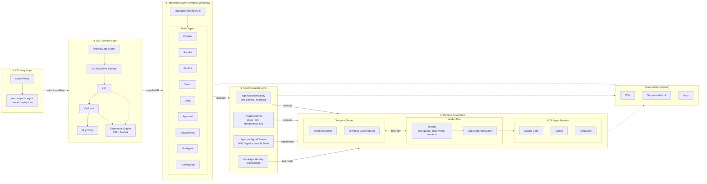
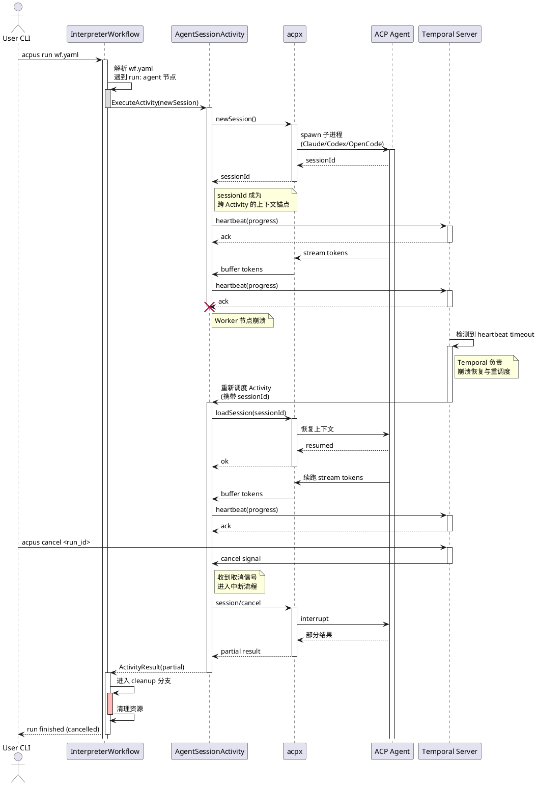

# acpus Draft Design — 基于 Temporal 的 ACP Agent YAML 编排

> **版本**: v0.1（Draft）  
> **状态**: 评审中  

---

## 引言

`acpus` 是一个**单二进制 CLI**，以 **Temporal** 作为持久化执行内核，对外提供一套**自定义 YAML DSL**，用于编排任意基于 **ACP（Agent Client Protocol）** 协议的 AI Agent（Claude Code / Codex / OpenCode 等）以及普通 program 步骤，最终实现"**任意中断、任意续跑、可审批、可观测**"的 Agent 工作流引擎。

本文档为 Draft Design v0.1，仅定义系统的架构骨架、对外接口、DSL 语义、可观测性与测试策略。所有命名（`acpus`、`InterpreterWorkflow`、`AgentSessionActivity`、`MockAgent` 等）均为 placeholder，可在后续 PR 中再统一。

---

## 1. 背景简述

### 1.1 趋势与协议背景

ACP（Agent Client Protocol）由 Zed 在 2025 年开源，是一套类似 LSP 的 **JSON-RPC 2.0 over stdio** 标准，让任意 IDE / 宿主程序可以以子进程方式启动并控制任意 AI 编程 Agent。Claude Code、Codex CLI、OpenCode、Gemini CLI、Goose 等已陆续支持 ACP。

- **session 是 ACP 的一等公民**：每个 session 在 server 端有上下文，宿主可以 `newSession`、`loadSession`、`prompt`、`cancel`，崩溃后凭 sessionId 即可恢复对话上下文。
- **acpx**（OpenClaw 提供的 ACP CLI 网关）封装了"启动子进程 / 维护 session / 路由 RPC"等本地化能力，是宿主与 ACP agent 之间稳定的本地控制器。

这两点合起来意味着：**只要一个上层编排器能稳定持久化"我现在跑到了哪个节点 / 这个节点对应哪个 sessionId"，agent 本身就能在重启后续跑。**

### 1.2 我们要解决的问题

> [!NOTE]
> **核心诉求**：在多 Agent / 长链路 / 高失败率 / 需要人工审批的现实编程场景下，让用户**用一份声明式 YAML** 把"调用哪个 agent + 跑哪个脚本 + 拿什么输出 + 何时分支 / 并发 / 循环 / 等审批"写清楚，运行时**任意机器、任意时刻被打断都能从断点续跑**，并且**可观测、可重放、可调试**。

具体的 DSL 原语需求：`pipeline`、`fanout`、`parallel`、`branches`、`loop`、`approval`、`subworkflow`、`agent`、`program`。

### 1.3 选型结论（已确定）

经过与 Microsoft Conductor、Argo Workflows、LangGraph、Restate 的对比，已选定 **Temporal 作为底座**。理由：

1. **持久化执行**与"任意中断 / 重试 / 续跑"是字面意义上的 1:1 匹配。
2. **Signal + durable Timer + Child Workflow** 直接覆盖 approval、loop、subworkflow 三个偏门原语。
3. **Sticky Execution + 显式 task queue** 配合 ACP `loadSession` 可以形成"双保险"的本地性 / 容错能力。
4. **生态成熟**：Replit、Fabric、XY、Grid Dynamics 等已有大量 Agent on Temporal 生产案例。

---

## 2. 架构设计

### 2.1 总览

`acpus` 采用经典的"**编译器 + 解释器 + 执行器**"分层；其中"解释器"运行在 Temporal Workflow 内（这就是所谓 **workflow-as-data** 模式：DSL 是数据，Temporal Workflow 是解释器，不需要为每个 DSL spec 生成代码）。



### 2.2 五层职责拆解

| 层 | 职责 | 关键组件 |
|---|---|---|
| L5 CLI | 用户入口，只负责把 YAML 读进来、连接 Temporal、提交 Workflow、流式拉取状态 | `acpus` 主二进制；`run / inspect / signal / cancel / replay / lint` 子命令 |
| L4 DSL Compiler | 静态校验、解析、宏展开、`include` 扁平化、表达式预编译，最终输出**可序列化的 IR**（JSON） | JSONSchema / CUE schema；CEL 表达式编译器；IR 对象模型 |
| L3 Interpreter | 把 IR 翻译成 Temporal API 调用：顺序 await、并发 `Selector`、Signal 等待、Timer、Child Workflow…**所有非确定性都被关在 Activity 里** | `InterpreterWorkflow(IR, input) -> output` |
| L2 Activities | 承载所有 I/O：调 acpx、跑 program、收 Signal、写日志、写 trace | `AgentSessionActivity`、`ProgramActivity`、`ApprovalSignalChannel`、`MockAgentActivity`、`ArtifactStorageActivity` |
| L1 Runtime | 持久化、调度、容错 | Temporal Server（dev: temporalite / prod: cluster）；Worker Pool；本地 acpx 子进程池 |

### 2.3 ACP Agent 的生命周期映射

ACP session 是带状态的子进程，"任意中断 → 恢复"必须做到。下图展示一次典型 prompt 在崩溃 → 恢复 → 取消三个事件下的流转。



**关键设计点**：

1. **每次 prompt = 一个 Activity**。Activity 内部通过 acpx 复用 sessionId；进程没死直接发，进程死了就 `loadSession` 重启。
2. **Heartbeat 是续跑的钥匙**。Activity 持续 heartbeat 把 sessionId、进度、最近一次 token offset 写回 Temporal；崩溃后新 worker 拿到的 ActivityInput 里包含上次的 sessionId。
3. **取消语义双向传播**。Workflow cancel → Temporal 把 ctx.Done 喂给 Activity → Activity 调 ACP `session/cancel` → 子进程返回 partial result → Activity 把 partial 落到 state，便于"取消后人工接力"。
4. **Worker 亲和**。每台机器自己一个 task queue（`acpx-worker-<nodeId>`），Workflow 把 task queue 写到 state；Agent 后续所有 prompt 都派回这台机器，避免跨机抓取工作区。
5. **Agent Entity Workflow（可选）**。复杂场景（如多个 Agent 之间需要 audit、需要并发 prompt 节流）可把每个 Agent 包成一个长生命周期 Entity Workflow，对外暴露 Signal `prompt(text)` 和 Query `status()`。

### 2.4 数据流与状态

- **Workflow State**：保留控制流必须的最小状态（节点输出 hash、sessionId、approval 结果、loop 计数器）。**绝不**直接塞 LLM 长输出。
- **Artifact 大对象**：通过 `ArtifactStorageActivity` 写到对象存储（本地：`~/.acpus/runs/<run_id>/artifacts/`；生产：S3/OSS），在 state 里只留 `artifact://<id>`。
- **Event History**：Temporal 自动持久化每次 ActivityScheduled / Started / Completed，是天然的 audit trail。

### 2.5 部署形态

**Dev 模式（默认）**

```
acpus run wf.yaml
  └─ 启动 in-process temporalite (SQLite)
  └─ 启动 in-process Worker
  └─ 启动 Workflow
  └─ tail 状态到终端
```

零依赖，单进程，关掉 CLI 即停。重启后用 `acpus run --resume <run_id>` 续跑（实际是 Temporal 自动 resume，CLI 重新连上去拉状态）。

**Prod 模式**

```
acpus run wf.yaml \
  --server temporal.acme:7233 \
  --task-queue team-fe
```

Temporal Cluster 独立部署。Worker 集群常驻，每台机器跑一个 `acpus worker`（独立 task queue，预装 Claude Code/Codex 二进制 + acpx）。CLI 只是提交器，提交后即可断开。

---

## 3. CLI 接口设计

CLI 的设计原则：**子命令最少、行为最可预测、无副作用命令优先**。

### 3.1 子命令一览

| 命令 | 含义 | 典型用法 |
|---|---|---|
| `acpus run` | 提交并执行一个 workflow spec | `acpus run wf.yaml --input pr_url=https://...` |
| `acpus lint` | 静态校验 DSL（schema + 表达式 + 引用闭包） | `acpus lint wf.yaml --strict` |
| `acpus ls` | 列出运行中 / 已完成的 run | `acpus ls --status running --since 1h` |
| `acpus inspect` | 查看 run 的当前节点 / state / event history | `acpus inspect <run_id> --tail` |
| `acpus signal` | 向 run 发送 Signal（审批、注入参数、唤醒等待） | `acpus signal <run_id> approval:gate '{"approved":true}'` |
| `acpus cancel` | 取消 run，触发 ACP cancel 与 cleanup | `acpus cancel <run_id> --reason "abort"` |
| `acpus resume` | 显式 resume（一般场景下 Temporal 自动 resume，本命令仅用于客户端重连） | `acpus resume <run_id> --tail` |
| `acpus replay` | 本地重放 history（解释器 bug 调试） | `acpus replay wf.yaml --history h.bin` |
| `acpus worker` | 启动一个常驻 worker（生产） | `acpus worker --task-queue acpx-worker-node1` |
| `acpus agents` | 列出本机已注册 ACP agent（来自 acpx 的 registry） | `acpus agents ls / install / test` |
| `acpus mock` | 启动一个 mock agent 服务（见第 6 节） | `acpus mock --script mock.yaml` |

### 3.2 输出格式约定

- 默认：人类可读，stderr 打 progress（带颜色），stdout 打最终 outputs（JSON）。
- `--json`：所有输出 JSONL，方便管道（`acpus run wf.yaml --json | jq ...`）。
- `--quiet`：只输出最终结果（用于 CI）。
- `--watch`：长连接订阅 Temporal Visibility 事件，等价于 `inspect --tail`。

### 3.3 退出码规范

| 退出码 | 含义 | 触发场景 |
|---|---|---|
| 0 | workflow 成功完成 | 所有节点 success，最终 outputs 已写 |
| 2 | 用户取消 | `acpus cancel` 或 Ctrl+C |
| 10 | DSL 静态错误 | schema/表达式/引用未通过 `lint` |
| 20 | workflow 运行时失败（非可重试） | 某 Activity 终态失败，Workflow 抛错 |
| 21 | workflow 超出 deadline | spec 里的 `deadline` 命中 |
| 30 | approval 超时 | 审批 Signal 在 `timeout` 内未到，且 `on_timeout: fail` |
| 40 | 底座连接失败 | Temporal Server 不可达 |

### 3.4 输入与上下文

- `--input k=v`（重复多次）或 `--input-file input.json`：注入 workflow 顶层 `input`。
- `--secret k=@file` / `--secret k=$ENV_VAR`：通过 secret 引用注入，不进 Workflow History（用 `SideEffect` 派发到 Activity）。
- 工作目录：`--workspace .`（默认 cwd），所有 program / agent 都基于此目录派生子进程。

---

## 4. YAML DSL 设计

### 4.1 设计原则

1. **数据描述，不是代码**。所有动态计算放进显式表达式 `${{ ... }}`（CEL），不允许嵌入任意编程语言。
2. **节点是一等公民**。每个 step 必须有 `id`，输出固定挂在 `steps.<id>.output`。
3. **副作用显式**。program / agent 步骤都标注 `side_effects: read | write | none`，决定能否安全重试。
4. **正交而非堆砌**。原语就 8 个：`run` / `parallel` / `fanout` / `switch` / `loop` / `approval` / `subworkflow` / `include`，组合表达力即可覆盖绝大多数场景。
5. **导入与复用**。`include` 把另一个 spec 内联进来；`subworkflow` 当作 child workflow 启动（独立可观测、可单独取消）。

### 4.2 基础形态

```yaml
version: 1
name: <workflow-name>
description: <human readable>
input:
  <param>: { type: string, required: true, default: <value> }
secrets:
  - OPENAI_API_KEY
defaults:
  retry: { max_attempts: 3, initial_interval: 5s, backoff: 2.0 }
  timeout: 30m
agents:
  <ref>:
    type: claude-code | codex | opencode | <acp-registry-id>
    model: <model>
    cwd: ${{ input.workspace }}
    env: { ... }
    tools_allowlist: [fs.read, fs.write, shell]
    max_concurrency: 1
artifacts:
  store: local | s3
  prefix: ${{ run_id }}
workflow:
  steps: [ ... ]
outputs:
  <key>: ${{ steps.<id>.output.<path> }}
```

### 4.3 八条原语速查

| 原语 | 语法骨架 | 语义 |
|---|---|---|
| `run: agent` | `{ id, run: agent, use, prompt, output?: { schema }, on_error? }` | 对一个 ACP agent session 发送 prompt，等待 final message；output 写进 `steps.<id>.output` |
| `run: program` | `{ id, run: program, cmd, env?, idempotency_key?, side_effects? }` | 跑外部命令；带 `idempotency_key` 时自动 dedupe（防重试副作用） |
| `parallel` | `{ parallel: [steps...], max_concurrency? }` | 静态并发；所有分支必须全部成功才进下一节点（除非 `on_error: continue`） |
| `fanout` | `{ fanout: { over: <list>, as: <var>, do: [steps...], join: all\|race\|quorum, max_concurrency? } }` | 动态展开（map）；`join` 决定汇聚策略 |
| `switch` | `{ switch: [{ when: <expr>, do: [...] }, { else: [...] }] }` | 条件分支 |
| `loop` | `{ loop: { while: <expr> \| until: <expr>, max_iterations, do: [...] } }` | 带上限循环；每次迭代是一个独立 scope，可读 `loop.iter` |
| `approval` | `{ approval: { prompt, channels?, timeout, on_timeout: fail\|escalate\|approve\|reject } }` | 等待外部 Signal；durable Timer 兜底 |
| `subworkflow` | `{ subworkflow: <path>, input: {...}, async?: bool }` | 启动 child workflow |

### 4.4 表达式（CEL）能力清单

- 上下文变量：`input.*`、`secrets.*`、`steps.<id>.output.*`、`loop.iter`、`run_id`、`now()`（**确定性**now，从 Workflow 时钟取）
- 函数：`len`、`startsWith`、`matches`、`json.parse`、`hash.sha256`、`coalesce`
- 类型：string / int / bool / list / map（无浮点比较默认 epsilon）
- **禁用**：任意外部 I/O、随机数、系统时间

### 4.5 案例集（从简单到复杂）

下面给 4 个真实案例，覆盖你提到的全部典型场景。所有案例假设当前目录是项目根目录，agent 已在 acpx 注册。

#### 案例 A：简单 plan-review-impl（顺序 + 审批 + 单 agent）

> 场景：一个开发者对仓库提一个简单 feature 需求，先让 Claude Code 出方案，人工审批后再让 Codex 实现，最后跑测试。

```yaml
version: 1
name: plan-review-impl
input:
  feature: { type: string, required: true }
agents:
  planner:  { type: claude-code, model: sonnet-4.5 }
  coder:    { type: codex,       model: gpt-5 }
workflow:
  steps:
    - id: plan
      run: agent
      use: planner
      prompt: |
        Read repo structure, then propose an implementation plan for:
          ${{ input.feature }}
        Output: numbered steps + risk list.
      output_format: markdown

    - id: human_review
      approval:
        prompt: "Review plan in steps.plan.output. Approve to proceed?"
        timeout: 24h
        on_timeout: fail

    - id: implement
      run: agent
      use: coder
      prompt: |
        Implement the following plan exactly:
        ${{ steps.plan.output }}
        Open files, edit, and stage commits.
      side_effects: write

    - id: test
      run: program
      cmd: ["bash", "-lc", "make test"]
      side_effects: read
      retry: { max_attempts: 2 }
outputs:
  plan: ${{ steps.plan.output }}
  patch_ref: ${{ steps.implement.output.commit_sha }}
```

#### 案例 B：大规模多 Agent 多抗性 Review（fanout + parallel + 投票）

> 场景：对一个大 PR 用 3 个不同模型 + 3 类视角并行 review，最后投票合议。任一 agent 卡住不影响整体（quorum）。

```yaml
version: 1
name: multi-agent-review
input:
  pr_url: { type: string, required: true }
agents:
  claude:  { type: claude-code, model: sonnet-4.5 }
  codex:   { type: codex,       model: gpt-5 }
  open:    { type: opencode,    model: glm-4.6 }
workflow:
  steps:
    - id: fetch_pr
      run: program
      cmd: ["bash", "-lc", "gh pr checkout ${{ input.pr_url }}"]
      side_effects: write

    - id: reviews
      fanout:
        over: ["security", "performance", "readability"]
        as: aspect
        max_concurrency: 9
        join: quorum                 # 至少 2/3 视角完成即可
        quorum: 2
        do:
          - id: by_claude
            run: agent
            use: claude
            prompt: "Review PR ${{ input.pr_url }} for ${{ aspect }} issues. Return JSON {issues:[...]}."
            output_format: json
            timeout: 10m
          - id: by_codex
            run: agent
            use: codex
            prompt: "Same task as above but from Codex viewpoint."
            output_format: json
            timeout: 10m
          - id: by_open
            run: agent
            use: open
            prompt: "Same task from OpenCode viewpoint."
            output_format: json
            timeout: 10m

    - id: aggregate
      run: program
      cmd: ["acpus-tool", "vote", "--input", "${{ steps.reviews.output }}"]
      side_effects: none

    - id: gate
      approval:
        prompt: |
          Aggregated issues:
          ${{ steps.aggregate.output.summary_md }}
          Approve auto-comment to PR?
        channels: [feishu, cli]
        timeout: 12h
        on_timeout: reject

    - id: post_comment
      switch:
        - when: ${{ steps.gate.approved }}
          do:
            - run: program
              cmd: ["gh", "pr", "comment", "${{ input.pr_url }}", "--body-file", "${{ steps.aggregate.output.body_path }}"]
              side_effects: write
        - else:
            do:
              - run: program
                cmd: ["echo", "skipped"]
```

要点：
- `fanout.join: quorum` 让 9 个 agent 调用中只要 6 个返回就继续，避免长尾卡死
- `aggregate` 用普通 program（非 agent）做投票合并，确定性、可重放
- 审批走多通道（飞书/CLI）

#### 案例 C：大规模重构 + Fix Loop（fanout + loop + subworkflow）

> 场景：把一个 monorepo 的某模块从框架 A 迁到框架 B；先批量改文件，然后进入"跑测试 → 修失败 → 再跑"循环，直到全绿或 5 轮放弃。

```yaml
version: 1
name: refactor-and-fix
input:
  module: { type: string, required: true }
  from_framework: { type: string, required: true }
  to_framework:   { type: string, required: true }
agents:
  refactorer: { type: claude-code, model: opus-4 }
  fixer:      { type: codex,       model: gpt-5 }
workflow:
  steps:
    - id: discover
      run: program
      cmd: ["acpus-tool", "list-files", "--module", "${{ input.module }}"]
      output_format: json

    - id: rewrite_files
      fanout:
        over: ${{ steps.discover.output.files }}
        as: file
        max_concurrency: 4              # 控制并发，保护 IDE / 编辑冲突
        join: all
        do:
          - subworkflow: ./refactor-one-file.spec.yaml
            input:
              file: ${{ file }}
              from: ${{ input.from_framework }}
              to:   ${{ input.to_framework }}

    - id: fix_loop
      loop:
        until: ${{ steps.fix_loop.last.iter_output.tests_green }}
        max_iterations: 5
        do:
          - id: run_tests
            run: program
            cmd: ["bash", "-lc", "pnpm test --json > .test.json || true"]
            output_format: json_file
            artifact: .test.json
          - id: parse_failures
            run: program
            cmd: ["acpus-tool", "parse-jest", "--input", ".test.json"]
            output_format: json
          - id: fix_one_round
            switch:
              - when: ${{ len(steps.parse_failures.output.failures) > 0 }}
                do:
                  - run: agent
                    use: fixer
                    prompt: |
                      The following tests failed in module ${{ input.module }}:
                      ${{ steps.parse_failures.output.failures_md }}
                      Fix them. Do not change unrelated files.
                    side_effects: write
              - else:
                  do:
                    - run: program
                      cmd: ["echo", "all green"]
          - id: assert
            run: program
            cmd: ["bash", "-lc", "echo ${{ len(steps.parse_failures.output.failures) }}"]

    - id: final_gate
      approval:
        prompt: "Refactor done. Patches summary in steps.fix_loop.summary. Push branch?"
        timeout: 24h
        on_timeout: reject
```

要点：
- `subworkflow` 让"改一个文件"成为可独立观测、可独立重试的 child workflow（出错只影响一个文件）
- `loop.until` 用 `last.iter_output.tests_green` 自我反馈
- `max_iterations: 5` 防死循环
- `max_concurrency: 4` 防止多 agent 同时编辑同一仓库导致 git 冲突

#### 案例 D：Deep Research（dynamic fanout + 多轮 plan）

> 场景：用 Claude Code（搜索/规划）+ OpenCode（采集/读取）+ Codex（写报告）做一份 deep research。先生成子问题，再并行采集，再多轮提炼。

```yaml
version: 1
name: deep-research
input:
  topic: { type: string, required: true }
  depth: { type: int,    default: 2 }
agents:
  planner:    { type: claude-code, model: opus-4 }
  collector:  { type: opencode,    model: glm-4.6 }
  writer:     { type: codex,       model: gpt-5 }
workflow:
  steps:
    - id: plan
      run: agent
      use: planner
      prompt: |
        For topic "${{ input.topic }}", produce a JSON tree with up to
        ${{ input.depth }} levels of sub-questions.
      output_format: json

    - id: collect
      fanout:
        over: ${{ steps.plan.output.leaves }}      # 叶子子问题
        as: q
        max_concurrency: 8
        join: all
        do:
          - run: agent
            use: collector
            prompt: |
              Search the web and return JSON {q, findings:[{url, snippet}]}.
              Question: ${{ q.text }}
            timeout: 8m
            retry: { max_attempts: 3 }

    - id: refine
      loop:
        until: ${{ steps.refine.last.iter_output.coverage >= 0.9 }}
        max_iterations: 3
        do:
          - run: agent
            use: planner
            prompt: |
              Given findings ${{ steps.collect.output }} and previous gaps
              ${{ coalesce(steps.refine.last.iter_output.gaps, []) }},
              propose follow-up sub-questions.
              Output JSON {gaps:[], coverage: 0..1}.
            output_format: json
          - run: program
            cmd: ["acpus-tool", "merge-findings", "--in", ".findings.json"]

    - id: human_outline
      approval:
        prompt: "Outline & coverage in steps.refine.last.iter_output. Approve writing?"
        timeout: 6h
        on_timeout: reject

    - id: write
      run: agent
      use: writer
      prompt: |
        Write a research report in markdown for topic ${{ input.topic }}
        from outline ${{ steps.refine.last.iter_output.outline }}.
      output_format: markdown
      artifact: report.md
outputs:
  report: ${{ steps.write.artifact }}
```

要点：
- 三种 agent 角色互不重叠，prompt 里带强 schema 提示（output_format=json 时框架会校验）
- `loop.until` 用覆盖率自循环
- `artifact: report.md` 让大对象走对象存储而非塞 history

---

## 5. 可观测性设计

### 5.1 三层视角

**Workflow 视角**

Temporal Web UI 自带：当前节点 / 已执行节点；Event History 时间轴；Activity 重试历史；Pending Signal / Timer。`acpus inspect <run_id>` 是它的命令行复刻。

**节点视角**

每个 DSL step 进入 IR 时附加：`step_id` → ActivityType 前缀；`step_kind`（agent/program/...）；`agent_ref` / `cmd_hash`。OTel span 的 attribute 直接打这些字段，Web UI 上一眼能定位"是哪条 step 在跑"。

**Agent 视角**

`AgentSessionActivity` 内部生成额外 span：`acp.session_id`；`acp.method`（newSession/prompt/cancel）；`acp.tokens_in/out`；`acp.tool_calls`。接入 Braintrust / OpenLLMetry，做 prompt-level eval。

### 5.2 数据出口

- **Logs**：每个 Activity 产出结构化 JSONL（`run_id` / `step_id` / `attempt` / `phase`），写本地 `~/.acpus/runs/<run_id>/logs/<step_id>.log`，并镜像到 stdout（`--watch` 时）。
- **Metrics**：暴露 OTel metrics（`acpus_step_duration`、`acpus_step_retries`、`acpus_agent_tokens`、`acpus_approval_pending`），可对接 Prometheus / Grafana。
- **Traces**：OTel traces 一条线串到底（CLI → Workflow → Activity → acpx → Agent），trace context 跨 ACP 请求。
- **Artifacts**：所有 step 的 stdout/stderr/output/artifact 落 `~/.acpus/runs/<run_id>/artifacts/`，URL 形式 `artifact://<run_id>/<step_id>/<name>`。
- **Replay Bundle**：`acpus inspect <run_id> --export` 打包 history.bin + IR + 所有 artifact，离线交付给开发者本地 replay。

### 5.3 关键 SLI / SLO

| 指标 | 含义 | 建议 SLO | 用途 |
|---|---|---|---|
| workflow success rate | 非用户取消的 run 成功率 | ≥ 99%（p7d） | 系统健康 |
| step retry ratio | 每节点平均重试次数 | ≤ 1.2 | 定位"经常翻车"的 step |
| agent activity p99 latency | 单次 prompt activity 耗时 | ≤ 8min（可调） | 定位卡死 agent |
| approval median wait | 审批中位等待时间 | 业务相关 | 看人介入是否成为瓶颈 |
| history size p95 | workflow event history 大小 | ≤ 5MB | 预警 history 膨胀，提前 Continue-As-New |

### 5.4 实时调试 UX

- `acpus inspect <run_id> --tail`：实时 stream events + 当前节点 + agent 流式 token（接 acpx 的 stream API）
- `acpus inspect <run_id> --tree`：树形展示 fanout / subworkflow / loop 嵌套，带耗时/状态色
- `acpus inspect <run_id> --diff <step_a> <step_b>`：比较两次 step 的输出（适合 loop 迭代）

---

## 6. 测试 / 调试能力 — 通用 Mock Agent

> 这是**最有杠杆**的章节：让所有"高成本、高不确定性、需要外网/真模型/真子进程"的 agent 节点，**在测试期被一个稳定的 mock agent 替换**，从而覆盖各种执行场景而不真烧钱、不依赖外部环境。

### 6.1 核心思路

设计一个独立二进制 `acpus-mock-agent`，**对外 100% 兼容 ACP 协议**（即可以被 acpx 当成普通 ACP server 启动），**对内由一份 YAML 脚本驱动**，决定它收到 prompt 时如何回复、回复多快、是否模拟失败、是否 stream 多少 token、是否在中间崩溃。

由于它说 ACP，所以**对 acpus / acpx 都完全透明**——你只是把 `agents.<ref>.type` 从 `claude-code` 换成 `mock`，其他全不动。CI 里 100% 跑 mock，本地开发可以混用。

### 6.2 Mock Agent 协议表面

实现 ACP 必要 endpoint：

| 方法 | 真 agent 行为 | Mock 行为 |
|---|---|---|
| `initialize` | 声明 capabilities | 声明所有 cap=true（除非脚本要求 false） |
| `session/new` | 新建 session 上下文 | 分配 sessionId，记录 prompt log 文件位置 |
| `session/load` | 恢复 session 上下文 | 从 prompt log 重建对话历史，按脚本决定是否 honor 上次 progress |
| `session/prompt` | 发 prompt → 流式输出 | 查脚本规则 → 根据匹配的 reply 进行模拟 |
| `session/cancel` | 立刻中断输出 | 立刻中断；返回 `partial` 标志和已输出 token 数 |

### 6.3 Mock 脚本 DSL（mock.yaml）

```yaml
version: 1
agent_id: codex-mock
default_response:
  type: text
  text: "OK."
  stream:
    chunks: 20             # 流式 20 个 chunk
    chunk_interval: 50ms

# 规则按顺序匹配，第一个命中即生效
rules:
  - name: "plan-prompt"
    when:
      prompt_contains: "implementation plan"
    respond:
      type: text
      text: |
        ## Plan
        1. Step A
        2. Step B
      stream: { chunks: 50, chunk_interval: 30ms }

  - name: "tool-call"
    when:
      prompt_matches: "fix.*test"
    respond:
      type: tool_calls
      calls:
        - name: edit_file
          arguments: { path: src/foo.ts, patch: "..." }
        - name: shell
          arguments: { cmd: "pnpm test" }

  - name: "json-output"
    when:
      prompt_matches: "Return JSON"
    respond:
      type: json
      payload:
        issues:
          - { file: "x.ts", line: 12, level: "warn", msg: "TODO" }

  - name: "flaky"
    when:
      prompt_contains: "search the web"
    respond:
      type: error
      probability: 0.3        # 30% 失败
      error: { code: 500, message: "rate limited" }
      otherwise: { type: text, text: "found 3 results..." }

  - name: "slow-then-crash"
    when:
      prompt_contains: "very long"
    respond:
      type: text
      text: "loading..."
      stream: { chunks: 1000, chunk_interval: 200ms }
      crash_after_chunks: 30   # 第 30 个 chunk 后让进程 abort，模拟 worker 崩溃

  - name: "needs-approval-tool"
    when: { prompt_contains: "deploy" }
    respond:
      type: tool_calls
      calls:
        - name: deploy
          requires_approval: true   # 触发 ACP permissions 请求

# 全局可注入故障
chaos:
  startup_delay: 100ms..2s     # 启动随机延迟
  prompt_jitter: 50ms..500ms
  random_disconnect_rate: 0.05 # 5% session 中途断
```

**关键能力**：
1. **基于 prompt 的规则匹配**：substring / regex / structured（看 tool 列表 / 看 system prompt）
2. **多种回复形态**：text / json（自动序列化为 ACP 消息）/ tool_calls / error / partial
3. **流式可控**：chunk 数 + 间隔 + 中途崩溃
4. **概率注入**：probability + chaos block 让 CI 能跑成"压力 / 抗性"测试
5. **可记录可回放**：mock 把每次 prompt 和 reply 落地（`mock-trace.jsonl`），下次跑加 `--replay` 就严格按上次时序回放（Golden Test）

### 6.4 在 acpus 中接入 mock

```yaml
# spec 顶部声明
agents:
  coder:
    type: mock                       # 或保留 codex，在测试态由 --override 替换
    mock_script: ./tests/mock_codex.yaml
```

或 CLI 一次性替换：

```bash
acpus run wf.yaml --override-agent coder=mock --mock-script tests/mock_codex.yaml
```

### 6.5 测试金字塔

| 层级 | 覆盖范围 | 工具 | 速度 |
|---|---|---|---|
| Unit（DSL Compiler / Expr） | JSONSchema / CEL / IR 转换 | Go test | 毫秒级 |
| Unit（Interpreter Workflow） | 原语翻译正确性、确定性 | Temporal Go testsuite + replay test | 百毫秒级 |
| Integration（Mock Agent） | 端到端 spec 行为，含失败/取消/审批 | temporalite + acpus-mock-agent | 秒级 |
| Chaos / Replay | worker 崩溃 / 网络断 / 长 prompt 中断 | 同上 + chaos toxiproxy / kill 子进程 | 分钟级 |
| Smoke（真 agent，少量） | 真实 ACP agent 兼容性 | 本地有 Claude Code/Codex 的开发机 | 分钟级 |

### 6.6 关键测试场景清单（必须用 mock 覆盖）

> [!IMPORTANT]
> 下面这些场景在真 agent 上几乎无法稳定复现，但用 mock 都是一行配置：
>
> 1. **agent 中途崩溃** → `crash_after_chunks` → 验证 `loadSession` 续跑
> 2. **agent 永不返回** → `stream.chunk_interval: 1h` → 验证 `timeout + retry`
> 3. **agent 高重试率** → `probability: 0.5` → 验证 `retry.max_attempts` 与 backoff
> 4. **fanout 部分超时** → 不同 mock_script 模拟不同响应延迟 → 验证 `join: quorum`
> 5. **审批超时升级** → mock 不发 Signal → 验证 `on_timeout: escalate`
> 6. **loop 收敛 / 不收敛** → mock 第 N 轮才返回 success → 验证 `max_iterations`
> 7. **取消中途** → CLI 发 cancel → 验证 partial 输出与 cleanup
> 8. **subworkflow 一个分支失败** → 一个 mock_script 抛 error → 验证 `on_error: continue`
> 9. **大 payload** → mock 返回 5MB 文本 → 验证 artifact 自动落对象存储
> 10. **非确定性回放** → 用 `--replay` 验证 InterpreterWorkflow 严格幂等

### 6.7 调试技巧

1. **`acpus run wf.yaml --dry-run`**：只编译 DSL → IR，打印调度计划，不真跑（适合 review spec）
2. **`acpus replay wf.yaml --history h.bin`**：纯本地把上次 history 喂给本机的 InterpreterWorkflow，用于解释器逻辑回归
3. **`ACPUS_TRACE_RPC=1`**：把 acpx ↔ agent 的所有 JSON-RPC 包落地，事故复盘最有用的 artifact
4. **断点调试**：dev 模式下 InterpreterWorkflow 跑在本进程，可直接 attach delve

---

## 附录 A：关键决策一览（ADR 备忘）

| # | 决策 | 主要理由 |
|---|---|---|
| 1 | 底座选 Temporal | 持久化执行 + Signal/Timer/Child Workflow 全套必需 |
| 2 | Workflow-as-Data，而非 codegen | 新增 DSL 原语零成本 |
| 3 | 表达式用 CEL（不是 JS） | 沙箱 + 确定性 |
| 4 | Per-prompt Activity + Agent Entity Workflow | 兼顾审计与性能 |
| 5 | Worker per-node task queue | ACP 子进程必须本地 |
| 6 | 大对象走 artifact 存储，state 只存 ref | 防 history 爆炸 |
| 7 | dev=temporalite，prod=cluster，同一份代码 | 本地零依赖 |
| 8 | 原语只 8 条，组合优先于扩展 | 反 Argo 式过度堆砌 |
| 9 | Mock Agent 自带 chaos / replay | 测试可重复 |
| 10 | idempotency_key 是 program 一等公民 | 防重试副作用 |

## 附录 B：里程碑（建议）

1. **M1（1-2w）**：DSL Compiler + lint + IR JSONSchema + dry-run
2. **M2（2w）**：InterpreterWorkflow 实现 8 原语（先无 agent、program 用 echo 替）
3. **M3（1w）**：AgentSessionActivity + acpx 集成 + sessionId loadSession 重连
4. **M4（1w）**：Mock Agent + 关键测试场景全覆盖
5. **M5（1w）**：CLI 完整 + temporalite embed
6. **M6（持续）**：可观测性（OTel/Web UI 拓展）+ 安全沙箱 + 真 agent registry 集成

---

> 本文档为 Draft Design v0.1，期待团队 review 后补充：（1）多租户与权限模型；（2）成本治理（按 agent token / 时长结算）；（3）跨机器 artifact 共享方案；（4）真实 acpx CLI 的版本兼容矩阵。
