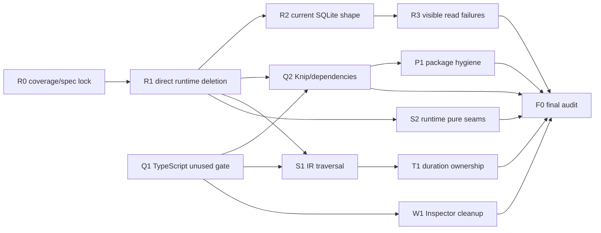

# Repository Maintenance Cleanup Roadmap

This roadmap turns the 2026-07-10 whole-repository clean-code audit into an
implementation sequence. It is a planning record, not current product truth.
Implemented behavior continues to live in `specs/`, and each implementation
slice updates the affected spec in the same change when behavior or a public
interface changes.

**Status:** completed 2026-07-10

**Primary outcome:** one durable runtime path, one current SQLite shape, visible
invariant failures, and automated gates that keep deleted residue from growing
back.

**Expected direction:** net source deletion. The first runtime slices alone
remove more than 1,000 lines before subtracting obsolete store and migration
code.

## Why This Work Exists

Acpus has been rebuilt around the TypeScript-first core and the durable
scheduler. Most current behavior follows that design, but several earlier
execution and persistence shapes survived the rebuild because they still
compiled or were exercised only by their own tests. They are low-risk at
runtime and high-cost in maintenance:

- a second, non-durable workflow interpreter has no production entrypoint but
  still owns 373 implementation lines, 666 test lines, and seven store methods;
- every writable SQLite open still runs a development-era migration framework,
  including DB-only frozen workflow compatibility that contradicts the current
  file-backed model;
- dynamic run reads convert every SQLite, decode, and projection failure into
  ordinary absence;
- the default compiler configuration accepts unused code, so old imports,
  helpers, components, and test scaffolding remain green;
- repeated `NodeIR` recursion, stable JSON, scope binding, duration parsing, and
  Inspector primitives make future changes fan out across unrelated files;
- package manifests and tarballs include stale dependency declarations,
  nonexistent file entries, and TypeScript build caches.

The repository is still greenfield. This plan therefore removes obsolete
behavior directly. It does not add deprecation layers, migration warnings,
compatibility fields, feature flags, or tests whose only purpose is to reject a
removed shape.

## Current and Target Runtime Shape

The current production path is already the target path:

```text
CLI / daemon / runtime use-cases
              |
              +-- advance: tryAdvanceRuntimeRun
              +-- control: applySchedulerControlIntent
                              |
                    durable scheduler
                              |
                    SchedulerStorePort
                       |             |
                  SQLite adapter   memory test adapter
```

`SchedulerStorePort` is a real seam: production and tests have independent
adapters. It remains. The old `execution/advance.ts -> execution/scheduler.ts`
is a parallel state machine, not an adapter, and is deleted. No new wrapper is
placed around `SchedulerStorePort` or `RuntimeStore`.

## Audit Baseline and Confidence

Confidence describes whether the implementation can begin immediately or first
needs a boundary check. Findings are ordered by confidence and maintenance
impact.

| ID | Confidence | Finding | Reproducible evidence | Planned disposition |
| --- | ---: | --- | --- | --- |
| F1 | 100% | Obsolete non-durable runtime island | `execution/advance.ts` and `execution/scheduler.ts` have no production caller; their only full consumer is a 666-line, 17-test file | Delete the island, its test, its seven store methods, and its blocked-state residue |
| F2 | 100% | Greenfield-incompatible SQLite compatibility layer | `migrate`, `schema_migrations`, 20 migration helpers/backfills, read-only migration preflight, and DB-only frozen JSON fallback run in the current store | Replace with one current schema initializer and file-only frozen artifacts |
| F3 | 100% | Dynamic read corruption is swallowed | `tryGetRunDynamicDetails` catches every exception and returns `undefined` | Let invariant/system failures throw; reserve `undefined` for genuine absence |
| F4 | 100% | Unused-code gate is disabled | Production package configs report 18 unique unused diagnostics; all 12 maintained configs report 40 | Clean all 40, then enable both TypeScript unused checks in the base config |
| F5 | 100% | Confirmed orphan exports and transitive orphan wrappers | Manual reachability finds at least 13 zero-consumer declarations; Knip finds a larger review queue after dynamic entries are configured | Delete confirmed orphans and adopt Knip for cross-file reachability |
| F6 | 100% | Package residue | All 9 packages publish `dist/.tsbuildinfo` (589,109 unpacked bytes in the audit build); only 2 have README files, none has a package-local LICENSE, and 8 manifests declare files that do not exist | Remove cache output and false manifest entries, then verify every tarball; treat package-local docs/licenses as an explicit release-policy choice |
| F7 | 100% | Redundant direct dependency edges | Runtime and workflow-compiler declare `@acpus/tasks` without importing it; loader already owns the dynamic facade map | Remove both direct edges and keep loader's real dependency |
| F8 | 98% | Repeated structural `NodeIR` recursion and impossible optional guards | Ten or more walkers duplicate the closed union; several still guard mandatory `if.else` and `switch.default` fields | Put one structural traversal seam next to `NodeIR`; keep semantic traversals local |
| F9 | 98% | Five stable-JSON implementations | Store, daemon, fork seed, hooks, and transitions recursively sort JSON independently | Use one private runtime implementation while preserving each caller's LF/hash bytes |
| F10 | 98% | Duplicate scheduler scope mutations | `scope.ts` and `materialize.ts` contain the same node/fanout/loop binding helpers | Deepen `scheduler/scope.ts`; do not add a builder or port |
| F11 | 98% | Duplicate and dead Web Inspector code | `App.tsx` contains two dead static inspectors; both Web entrypoints duplicate Inspector primitives and presence logic | Delete dead components, share named primitives, then share the safer presence hook |
| F12 | 95% | Duration grammar and parsing are owned by four layers | Core validator, runtime hooks, runtime resolver, and agent executor each encode the grammar | Put authored grammar in `@acpus/core/ir`; pass resolved milliseconds to the executor |

Baseline health before this roadmap edit:

- `pnpm typecheck` passed with the existing permissive compiler options.
- `pnpm test` passed: 90 files and 854 tests.
- the explicit unused-code scan found the failures described in F4.
- npm dry-run pack inspection found the package residue described in F6.

Those passing tests establish that the findings are maintenance residue, not a
request to change workflow semantics.

## Constraints and Non-goals

- `legacy/` remains read-only history.
- Current behavior changes land with their relevant `specs/*.md` and focused
  tests. Future-only detail remains in this roadmap until it lands.
- The ongoing expression predicate-helper change is outside this plan. Cleanup
  implementation touching CLI templates/examples starts after that change is
  merged or rebased, so its user-owned edits are not overwritten.
- No store-version framework, schema fingerprint module, legacy-field
  diagnostic, or automatic local-state reset is introduced.
- No generic visitor class, callback reducer framework, canonical-JSON port,
  scope builder, Inspector configuration DSL, or new utility package is added.
- Existing domain-specific switches remain when they select execution branches,
  validate malformed input, format a node kind, or derive representative fork
  paths. Structural recursion alone moves to the shared traversal seam.
- Tests target concrete risks at the lowest stable layer. Removed-only behavior
  does not receive compatibility tests, and whole-IR snapshots are not added.
- Public entry exports already asserted by a spec/type contract are not deleted
  solely because an internal reachability tool cannot see external consumers.
  Such exports need an explicit boundary decision in the same PR.

## Design Decisions

### D1. Delete the direct interpreter; retain the durable store port

Alternatives considered:

1. **Delete it (selected).** This leaves one state machine and one set of
   semantics for recovery, signals, race/quorum, loop, and failure.
2. Rename it to a reference interpreter. Rejected because it disagrees with the
   durable model and is not a valid oracle.
3. Deprecate it for one release. Rejected because that preserves the shallow
   store methods and mixed-state guards the cleanup is meant to remove.

### D2. Initialize only the current SQLite shape

`initializeSchema(db)` remains private to `store.ts` and contains the current
`CREATE TABLE/INDEX IF NOT EXISTS` statements. It does not inspect or upgrade
older development schemas. A non-current store fails naturally at the operation
that needs the missing current shape; the runtime does not classify it as a
migration case.

Frozen workflow bytes have one source of truth:

- `.acpus/.local/runs/<run-id>/workflow.ir.json`
- `.acpus/.local/runs/<run-id>/lock.json`

SQLite stores their non-null paths and digests, not duplicate JSON blobs.

### D3. Use a structural IR traversal, not a visitor framework

`@acpus/core` owns the closed `NodeIR` union, so `@acpus/core/ir` owns the
structural seam:

```ts
export type NodeChildScope =
  | { kind: "if"; owner: IfNodeIR; branchId: "then" | "else"; scope: ScopeIR }
  | { kind: "switch"; owner: SwitchNodeIR; branchId: `case:${number}` | "default"; scope: ScopeIR }
  | { kind: "parallel"; owner: ParallelNodeIR; branchId: string; scope: ScopeIR }
  | { kind: "fanout"; owner: FanoutNodeIR; scope: ScopeIR }
  | { kind: "loop"; owner: LoopNodeIR; scope: LoopTransitionScopeIR };

export type NodeVisit = {
  node: NodeIR;
  ancestry: readonly NodeChildScope[];
};

export function childScopes(node: NodeIR): readonly NodeChildScope[];
export function walkNodes(scope: ScopeIR): IterableIterator<NodeVisit>;
```

The walk is depth-first pre-order, preserves authored node/case/branch order,
and reports ancestry outermost-first. `childScopes` uses an exhaustive switch so
a new composite kind creates a compiler failure at the owner seam.

A `NodeIR`-only iterator was too shallow for visualization paths, ancestor
queries, and fork paths. A visitor/reducer was too broad because no caller needs
the same enter/leave/prune/error lifecycle.

### D4. Keep JSON, scope, and Inspector seams package-internal

- `packages/runtime/src/stable-json.ts` exports one private-package
  `stableJson(value)` with no trailing LF. Store/file/fingerprint callers add
  their existing LF at their byte boundary.
- `packages/runtime/src/scheduler/scope.ts` owns three named immutable binding
  functions: node output, fanout item, and loop iteration.
- `packages/web/src/client/ui/Inspector.tsx` owns the shared named primitives.
  Domain Inspector contents remain JSX in their entrypoint.

These have multiple real callers but no second adapter, so a port or class would
add interface without hiding complexity.

### D5. Combine TypeScript, Knip, and artifact checks

- TypeScript checks unused locals, parameters, imports, and private helpers.
- Knip checks unreachable files/exports and dependency declarations across
  workspace boundaries. Entry-export checking is enabled so public barrels are
  kept honest by their API/type contract tests rather than exempted.
- `scripts/verify-dist.js` checks Acpus-specific packed artifacts and executable
  entry targets.

A custom dead-export analyzer was rejected because it would need to reproduce
conditional exports, type-only exports, Vite/Vitest entry discovery, spawned
workers, and path-driven workflow fixtures.

### D6. Own authored duration parsing in core; execute resolved milliseconds

The authored grammar belongs to `@acpus/core/ir`, which already owns the IR
contract. It exposes a typed boundary helper:

```ts
export type DurationParseError =
  | { type: "invalid-duration-syntax"; value: string }
  | { type: "duration-out-of-range"; value: string };

export function tryParseDurationMs(
  value: string,
): Result<number, DurationParseError>;
```

The grammar accepts digits plus optional `ms | s | m | h`, treats no unit as
milliseconds, accepts zero, and rejects non-finite or non-safe-integer results.
The Result is consumed at validator/runtime boundaries and never enters IR,
events, SQLite, or CLI JSON.

`AgentTurnRequest` then uses `timeoutMs?: number`. The executor owns deadline
arithmetic, local timers, and `ceil(ms / 1000)` conversion for acpx; it no
longer parses authored syntax.

## Implementation Sequence

The slices below are intentionally mergeable PRs. R1 and R2 touch the same
large store file and are implemented in order even though their design work is
independent.

| Order | Slice | Status | Size | Depends on | Main result |
| ---: | --- | --- | --- | --- | --- |
| 0 | R0 — coverage/spec lock | completed | S | — | Existing durable tests are mapped to every valid old-interpreter risk |
| 1 | R1 — delete direct runtime island | completed | M | R0 | One scheduler and a smaller `RuntimeStore` |
| 2 | R2 — current-only SQLite and frozen files | completed | L | R1 | No migration or DB-only frozen compatibility |
| 3 | R3 — visible dynamic read failures | completed | S | R2 | Corruption throws instead of looking absent |
| 4 | Q1 — TypeScript unused gate | completed | M | expression work landed | 39 remaining diagnostics removed and permanently gated |
| 5 | Q2 — Knip/export/dependency gate | completed | M | R1, Q1 | Cross-file dead code and dependency drift gated |
| 6 | S1 — WorkflowIR traversal | completed | M | R1, Q1 | Structural recursion has one owner |
| 7 | S2 — stable JSON and scheduler scope | completed | S | R1 | Exact duplicates removed without public API |
| 8 | W1 — Web Inspector cleanup | completed | M | Q1 | Dead components deleted; two entrypoints share primitives and presence behavior |
| 9 | P1 — package artifact hygiene | completed | M | Q2 | Clean tarballs, truthful manifests, verified entry targets |
| 10 | T1 — duration ownership and numeric executor | completed | M | Q1, S1 | One grammar, resolved executor interface |
| 11 | F0 — final audit and archive | completed | S | all selected slices | Validation complete; roadmap moved to archive |



## R0 — Lock Current Coverage and Spec Ownership

**Status:** completed 2026-07-10. Durable unit coverage, runtime typecheck,
and adversarial review passed.

### Purpose

Delete the old interpreter without accidentally deleting a still-valid risk
oracle. The old test file is not ported line-for-line; each valid risk is mapped
to the current durable layer.

### Coverage map

| Old test concern | Current stable owner |
| --- | --- |
| assert conditions and optional message resolution | `scheduler-materialize.unit.test.ts`, `scheduler-node-executor.integration.test.ts` |
| if / switch / branch scope, including false-to-else selection | `scheduler-materialize.unit.test.ts`, `scheduler-node-executor.integration.test.ts`, core validator tests |
| parallel all/race | `scheduler-reducers.unit.test.ts`, `scheduler-advance.unit.test.ts` |
| fanout all, empty input, and input-order aggregation | `scheduler-materialize.unit.test.ts` |
| fanout quorum and completion-order aggregation | `scheduler-reducers.unit.test.ts`, `scheduler-advance-store.integration.test.ts` |
| loop state/stop | `scheduler-materialize.unit.test.ts`, `scheduler-node-executor.integration.test.ts` |
| signal prompt/payload/continuation | scheduler node-executor tests and admission normalization tests |
| undefined, non-finite, non-durable output | `admissible.unit.test.ts`, `scheduler-task-process.integration.test.ts` |
| missing provider/runner prerequisites | durable advance tests that end the run as failed |

### Files

- `specs/runtime-spec.md` as the owner of current requirements
- the durable test files in the table above
- `packages/runtime/test/runtime-scheduler.integration.test.ts` as the source
  inventory only

### Work

1. Link each still-current runtime requirement to a durable test owner in the PR
   checklist.
2. Add only a missing durable test that protects a current risk. Do not copy a
   test whose setup or assertion depends on the old interpreter.
3. Clarify only current behavior exposed by the coverage audit: fanout `all`
   aggregates by `itemIndex`/input order and returns `[]` for empty input.
   File-only frozen storage and fresh-store schema wording still land with R2,
   so `specs/` never describes behavior that is not yet implemented.

### Exit gate

- Every valid row above has a passing durable test.
- The runtime spec still describes the implementation present at the end of R0.
- No test introduces `blocked` as a durable runtime state.
- No removed-shape rejection test is added.
- No file under `legacy/` or `docs/roadmap/archive/` changes.

## R1 — Delete the Direct Runtime Island

**Status:** completed 2026-07-10. Clean runtime build, package dry-run,
workspace typecheck, 89-file/840-test suite, and two adversarial reviews passed.

### Delete

- `packages/runtime/src/execution/advance.ts`
- `packages/runtime/src/execution/scheduler.ts`
- `packages/runtime/test/runtime-scheduler.integration.test.ts`

Retain `agent-node.ts`, `task-executor.ts`, `task-process*.ts`, `inline-task.ts`,
and `duration.ts` at this stage; the durable node executor still consumes them.
Retain `execution/ir.ts` until S1 migrates its current admission caller.

### Shrink `RuntimeStore`

Remove these methods, input types, and implementations from
`packages/runtime/src/store/store.ts`:

- `completeRun` / `CompleteRunInput`
- `persistCompletedNodes` / `PersistCompletedNodesInput`
- `blockRun` / `BlockRunInput`
- `failRun` / `FailRunInput`
- `awaitSignal` / `AwaitSignalInput`
- `getSignalPayloads`
- `getCompletedNodeOutputs`

Simplify `RUNNABLE_RUNS_WHERE` to current durable status semantics. Its
`pending node_states.error_json` exclusion is an old blocked-state encoding and
leaves with the direct interpreter.

### Replace invalid test setup

- In `hooks-journal.integration.test.ts`, complete the admitted pure workflow
  through `advanceRuntimeRun` before testing terminal hook visibility.
- In `runtime-daemon.integration.test.ts`, build the terminal fixture through
  the same durable advancement path before testing journal pruning.
- Delete the scheduler-store test named “does not overwrite an already public-
  terminal run from scheduler bridge.” Its mixed state can only be built with
  old `completeRun`; it is unreachable in the current model.
- Keep normal terminal projection bridging, duplicate commit, and rollback
  tests.

### Remove adjacent zero-consumer wrappers

- Delete `advanceWorkflowRun` from `runs/use-cases.ts`.
- Delete CLI `sendDaemonObserveRun` and its then-transitive
  `sendDaemonStartRun` wrapper when the reachability scan confirms no caller.
- Remove `RuntimeStore`, `AdvanceRunSummary`, and `SchedulerStorePort` from the
  package entry barrel when the public type contract still does not assert
  them. Keep the internal types and the real seam.
- Leave `SchedulerStoreError` and `SchedulerStoreResult` alone in this slice;
  they are explicitly asserted today and are reviewed under Q2 with their spec
  consequences visible.

### Specs and release record

- Re-read `specs/runtime-spec.md`; it already describes the durable scheduler
  and omits the direct interpreter, so no spec diff is expected. Change it only
  if a still-current requirement is inaccurate after R1.
- Add a runtime changeset for the package-visible type-surface reduction. Do not
  add a compatibility alias.

### Exit gate

```sh
test ! -e packages/runtime/src/execution/advance.ts
test ! -e packages/runtime/src/execution/scheduler.ts
test ! -e packages/runtime/test/runtime-scheduler.integration.test.ts

! rg -n '\b(completeRun|persistCompletedNodes|blockRun|failRun|awaitSignal|getSignalPayloads|getCompletedNodeOutputs)\b' \
  packages/runtime/src packages/runtime/test
```

- Remaining files in `runtime/src/execution/` have a durable production caller
  or an independent current responsibility.
- Missing executor/provider coverage still ends as `failed`, never blocked.
- Runtime unit, contract, type, and integration projects pass.

## R2 — Collapse SQLite to the Current Shape

**Status:** completed 2026-07-10. Clean runtime build, workspace typecheck,
89-file/843-test suite, residue search, and two adversarial reviews passed.

### Schema changes

Rename `migrate(db)` to private `initializeSchema(db)` and retain only current
table/index creation. Delete:

- `DROP TABLE IF EXISTS commands`
- the `schema_migrations` table and version insert
- every `addColumnIfMissing` call and helper
- `storeNeedsMigration`, `hasTable`, and `hasColumn`
- `runInputsFrozenJsonNeedsNullabilityMigration`
- `migrateRunInputsFrozenJsonNullability`
- the read-only opener's “requires migration” preflight/error
- the historical `signal_waits` timestamp backfill

Do not replace these with a version detector or schema fingerprint.

### Frozen run source of truth

Change `run_inputs` so these fields are non-null:

- `workflow_ir_path`
- `workflow_ir_digest`
- `lock_path`
- `lock_digest`
- `run_dir`

Declare `signal_waits.created_at` and `updated_at` non-null in the current base
schema; the deleted backfill was the only reason they remained nullable.

Delete `workflow_ir_json` and `lock_json`. Then:

1. Make the corresponding `RunInputRow` fields required.
2. Remove inline-null placeholders from admission and fork INSERT statements.
3. Make frozen IR/lock readers always read the contained run-local file and
   always verify the digest.
4. Remove fork branches that accept a missing `run_dir` or DB-only frozen data.
5. Remove the full lock document from the `run.admitted` event payload; no
   current consumer reads it and the run-local file owns the document bytes.
6. Keep path containment, artifact-copy, digest, and lock verification local to
   the concrete fork operation.

### Tests

- `runtime-admission.integration.test.ts`
  - assert exact frozen bytes and current path/digest persistence;
  - retain the corrupted-file digest failure;
  - delete the DB-only row half;
  - cover missing files, path/run-directory escapes, and frozen file,
    run-directory, and runs-root symlinks.
- `scheduler-store-port.integration.test.ts`
  - delete the read-only “does not migrate” test and its now-unused imports.
- `scheduler-store-schema.integration.test.ts`
  - assert path/digest/run-dir columns and their non-null constraints;
  - assert signal timestamp non-null constraints;
  - assert fresh initialization, reachable writable reopen, and read-only
    inspection with a connection that rejects writes;
  - avoid an assertion whose sole purpose is to enumerate rejected old columns.
- `runtime-controls.integration.test.ts`
  - assert a lock digest mismatch aborts fork before a fork row is written.

Update `specs/runtime-spec.md` in this same slice so current truth states that:

- frozen IR/lock bytes live only in the run-local files and SQLite stores their
  non-null paths/digests;
- a new runtime store is initialized directly with the complete current schema.

Add a runtime changeset describing the resulting current file-backed store
shape without migration guidance or a compatibility promise.

### Exit gate

```sh
! rg -n 'schema_migrations|storeNeedsMigration|addColumnIfMissing|migrateRunInputsFrozenJsonNullability|runInputsFrozenJsonNeedsNullabilityMigration|hasTable|hasColumn|workflow_ir_json|lock_json|requires migration|DROP TABLE IF EXISTS commands|UPDATE signal_waits SET created_at|function migrate\(' \
  packages/runtime/src packages/runtime/test specs/runtime-spec.md
```

- A fresh workspace creates the complete current schema.
- Reopening a current writable store is idempotent.
- Read-only inspection performs no write.
- Admission, inspection, execution, and fork read frozen workflow data only
  from contained run-local files.
- Missing files, path escape, and digest mismatch are visible invariant
  failures.

## R3 — Restore Dynamic Read Error Visibility

**Status:** completed 2026-07-10. Runtime typecheck, clean build, 203 runtime
integration tests, and two adversarial reviews passed.

### Work

In `packages/runtime/src/store/store.ts`:

1. Rename `tryGetRunDynamicDetails` to `getRunDynamicDetails`.
2. Delete its catch-all.
3. Return `undefined` only when every dynamic collection is genuinely empty.
4. Allow SQLite errors, malformed scheduler envelopes, JSON decode failures,
   and projection invariant failures to throw.

This follows the repository error model: local absence is `undefined`;
invariant/system failure is an exception. A Result wrapper is unnecessary
because corruption is not a recoverable caller choice.

### Test

Extend a scheduler-store malformed-envelope integration test with this exact
sequence:

1. Before corruption, a fresh admitted run with no dynamic rows has
   `dynamic === undefined`.
2. After inserting a malformed current scheduler envelope,
   `store.scheduler.loadRunSnapshot(runId)` throws the decode failure.
3. `store.getRun(runId)` throws the same class/message instead of returning a
   run without `dynamic`.

### Spec

Update the runtime read-API section to distinguish absent dynamic state from a
failed durable-state read. Do not add a migration-specific diagnostic.

Add a runtime patch changeset for restored read-error visibility.

### Exit gate

- `tryGetRunDynamicDetails` no longer exists.
- The focused malformed-state test has a strong error oracle.
- Normal empty, running, awaiting, and terminal reads remain covered.

## Q1 — Enable TypeScript Unused-Code Checks Everywhere

**Status:** completed 2026-07-10. All maintained TypeScript configs inherit both
unused-code checks; four explicit compiler gates, clean build, 89-file/843-test
suite, residue search, and two adversarial reviews passed. R1 had already
removed the unread `prepared` fixture, so 39 diagnostics remained at Q1 start.

### Known cleanup inventory

Production source has 18 unique diagnostics:

- Core (6)
  - `ir/types.ts`: `JsonObject`, `TypeIR`
  - `ir/validator.ts`: `refsWithFanout`, `refsWithLoop`,
    `validateRequiredSchema`
  - `nodes/composite/fanout.ts`: unused `Strategy` generic
- Runtime (5)
  - `daemon/loop.ts`: `RuntimeUseCaseException`
  - `daemon/socket.ts`: `requestTracker`
  - `scheduler/materialize.ts`: `baseScope`
  - `scheduler/node-executor.ts`: `JsonValue`
  - `scheduler/runtime-runner.ts`: `WorkflowIR`
- Web (6)
  - `client/ui/App.tsx`: old `StaticWorkflowInspector` and
    `StaticGraphInspector`
  - `server/app.ts`: `join`
  - `server/graph.ts`: `compositeKinds`, `printExprRecord`
  - `server/workflows.ts`: `readFile`
- CLI (1)
  - `run-status-surface.ts`: `RunDynamicFrame`

The broader maintained configs originally added 22 diagnostics:

- `templates/workflow-init/starter.workflow.ts`: 14 unused showcase imports;
- skill examples: unused `template` in adversarial-review, issue-triage, and
  worktree-tournament, plus unused `index` in multi-aspect-brainstorm;
- runtime tests: `NodeInstance`, `SchedulerProjection`, an unread fake-store
  `runId`, and an unread `prepared` fixture.

API discoverability in the starter belongs in comments and the authoring
reference, not unused imports. Prefix a parameter with `_` only where an
external callback signature genuinely requires it; do not use underscore
renames as a bulk escape hatch.

### Gate

After all remaining diagnostics are clean, add to `tsconfig.base.json`:

```json
{
  "compilerOptions": {
    "noUnusedLocals": true,
    "noUnusedParameters": true
  }
}
```

No child config disables either option.

### Exit gate

```sh
pnpm typecheck
pnpm exec tsc -p tsconfig.vitest.json --noEmit --incremental false
pnpm exec tsc -p packages/cli/tsconfig.fixtures.json --noEmit --incremental false
pnpm exec tsc -p packages/workflow-compiler/test/tsconfig.json --noEmit --incremental false
```

All four commands complete with zero unused diagnostics.

## Q2 — Add Knip and Remove Cross-file Residue

**Status:** completed 2026-07-10. Knip 6.26, dead-code and both dependency
gates, PR/publish CI integration, explicit dynamic edges, dependency locality,
and package boundary decisions are in place. Clean build, workspace typecheck,
89-file/843-test suite, dist verification, generated-asset check, all three
Knip commands, dependency provenance checks, and two adversarial review rounds
passed. The first review found and the second closed one over-broad compiler
fixture exception.

### Tooling

Add a root dev dependency on a repository-selected Knip 6.x version compatible
with the root development Node engine, plus:

```sh
pnpm add -Dw knip@^6.26.0
```

```json
{
  "scripts": {
    "check:dead-code": "knip --include-entry-exports --include files,exports,nsExports,types,nsTypes,enumMembers,namespaceMembers,duplicates --treat-config-hints-as-errors",
    "check:dependencies": "knip --dependencies --treat-config-hints-as-errors",
    "check:dependencies:strict": "knip --strict --dependencies --treat-config-hints-as-errors"
  }
}
```

The non-strict dependency command covers repository development/build/test
dependencies. The strict command separately verifies direct production
dependency isolation inside each workspace; strict mode is not treated as a
replacement for the first command.

If the selected Knip version requires Node 22.12, record `>=22.12` as the root
development engine. This does not silently change published package engines.

### Configuration starting point

Create `knip.jsonc` with explicit root scope and dynamic entries. The exact
starting skeleton is:

```jsonc
{
  "$schema": "https://unpkg.com/knip@6/schema.json",
  "workspaces": {
    ".": {
      "entry": ["scripts/test.mjs", "scripts/verify-dist.js"],
      "project": ["scripts/**/*.{js,mjs}", "vitest.config.ts"]
    },
    "packages/*": {
      "project": [
        "src/**/*.{ts,tsx}!",
        "test/**/*.{ts,tsx,mjs}",
        "scripts/**/*.{js,mjs}",
        "vite.config.ts"
      ]
    },
    "packages/cli": {
      "entry": [
        "src/cli.ts!",
        "src/daemon-entry.ts!",
        "skills/acpus/examples/workflows/**/*.ts!",
        "test/fixtures/**/*.ts"
      ],
      "project": [
        "src/**/*.ts!",
        "test/**/*.ts",
        "templates/**/*.ts!",
        "skills/acpus/examples/workflows/**/*.ts!"
      ],
      "ignoreIssues": {
        // tsx is used only by the workspace source-mode daemon branch.
        "src/commands/daemon.ts": ["unlisted"]
      }
    },
    "packages/loader": {
      // These are resolved from the string-driven facade target map.
      "ignoreDependencies": [
        "@acpus/core",
        "@acpus/expression",
        "@acpus/tasks"
      ]
    },
    "packages/runtime": {
      "entry": [
        "src/execution/task-process-entry.ts!",
        "test/fixtures/**/*.ts"
      ],
      "ignoreIssues": {
        // tsx is used by the source-mode task subprocess branch.
        "src/execution/task-process.ts": ["unlisted"]
      }
    },
    "packages/web": {
      "entry": [
        "scripts/build.mjs",
        "scripts/build-static-viz.mjs",
        "src/client/static-viz.tsx"
      ],
      "ignoreIssues": {
        // Tailwind is a bundle-time CSS input.
        "src/client/styles.css": ["unlisted"]
      }
    },
    "packages/workflow-compiler": {
      "entry": [
        "src/compiler/compile-worker.ts!",
        "test/fixtures/**/*.ts",
        "test/eslint.config.mjs"
      ],
      "ignoreIssues": {
        // tsx is used by the source-mode compiler worker branch.
        "src/compiler/worker.ts": ["unlisted"],
        // This ambient module is consumed only by compiler fixtures.
        "test/fixtures/workflows/external-task.d.ts": ["unlisted"]
      }
    }
  }
}
```

Configuration rules:

- Keep the root project limited to scripts/config. Scanning the repository root
  would incorrectly treat `.acpus`, `.agents`, and user workflows as product
  source.
- Register `daemon-entry.ts`, `task-process-entry.ts`, and
  `compile-worker.ts` because they are spawned through computed paths.
- Register static-viz because it is a programmatic Vite entry.
- Treat fixtures/examples as independent path-driven compiler inputs.
- Keep `--include-entry-exports` in the dead-code script. Every intended public
  value/type export is referenced by the package's public API or type contract;
  an unreferenced barrel export is reviewed rather than silently exempted.
- Keep every exception narrow and explain the dynamic edge in a JSONC comment.
- Do not use broad workspace ignores, baseline suppressions, or `knip --fix`.

### Initial review queue

With the dynamic entries configured but before entry-export checking, the audit
found one old runtime file, 22 unused export groups, and 17 unused type groups.
Enabling `--include-entry-exports` can add public-barrel candidates. Re-run after
R1/Q1 because the old queue will shrink, then classify every result as:

1. confirmed dead implementation — delete;
2. internal test seam with a real caller — retain and make the caller visible;
3. public package entry contract — retain only when a spec/type contract names
   it;
4. dynamic entry — add one precise configuration edge.

Known confirmed deletions include:

- `core/src/internal/symbols.ts`: `EXPR`, `SCHEMA`, `TEMPLATE`
- `ScopeOutput`
- CLI daemon observe/start wrappers identified in R1
- runtime `advanceWorkflowRun`
- Web `terminalDisplayStatuses` and `isTerminalDisplayStatus`
- Web `ApiErrorBody`
- unused shadcn `DialogTrigger`, `DialogClose`, `PopoverAnchor`, `SelectGroup`

Review public runtime store/scheduler type re-exports separately; do not hide a
decision by adding them to Knip ignores.

### Dependency cleanup

Remove direct `@acpus/tasks` from:

- `packages/runtime/package.json`
- `packages/workflow-compiler/package.json`
- their `pnpm-lock.yaml` importers

Keep loader's dependency because it resolves string-driven facades such as
`acpus/tasks/git -> @acpus/tasks/git`. Keep CLI's dependency because it directly
re-exports the Git task authoring API.

### Exit gate

```sh
pnpm install --lockfile-only
pnpm check:dead-code
pnpm check:dependencies
pnpm check:dependencies:strict
pnpm --filter @acpus/runtime why @acpus/tasks
pnpm --filter @acpus/workflow-compiler why @acpus/tasks
```

- All three Knip commands are zero.
- Configuration hints are zero.
- Both `why` outputs show tasks only through loader.
- No existing finding is hidden by a broad ignore.
- Package graph changes have a changeset.

## S1 — Give WorkflowIR Structure One Owner

**Status:** completed 2026-07-10. Core owns exhaustive child-scope and pre-order
traversal; all named structural consumers use it, while validator, scheduler
materialization, and fork path semantics retain their specialized traversal.
Clean build, workspace typecheck, 90-file/849-test suite, all Knip gates,
residue searches, and two adversarial review rounds passed. The first review's
runtime path, nested compiler metadata, and Web/CLI count oracle gaps were
closed before the second review.

### Implement in core

- Add `packages/core/src/ir/traversal.ts` with D3's `NodeChildScope`,
  `NodeVisit`, `childScopes`, and `walkNodes`.
- Export them from `packages/core/src/ir.ts`.
- Add a focused core traversal unit test with one fixture containing all nine
  node kinds and every composite child scope.
- Assert exact pre-order and stable ancestry slices, including case-before-
  default and authored parallel branch order. Do not snapshot the whole IR.
- Update the core public-subpath type/API tests and `specs/core-spec.md`.
- Add a core changeset because `@acpus/core/ir` gains a public interface.

### Migrate structural consumers

- `runtime/src/scheduler/ir-walk.ts`: keep the three-caller `indexNodes` wrapper,
  implement it from `walkNodes`.
- `workflow-compiler/src/compiler/ir-walk.ts`: delete the one-caller wrapper and
  filter task visits directly in `compiler/module.ts`.
- `cli/src/run-status-surface.ts`
- `runtime/src/runs/use-cases.ts`
- `runtime/src/visualization/overlay.ts`
- `cli/src/output.ts`
- `cli/src/commands/workflow.ts`
- `web/src/server/workflows.ts`
- `runtime/src/scheduler/control.ts`
- store collectors for IDs, count, ancestors, and signatures
- fork-seed structural signature/path collection
- `runtime/src/admission/input.ts`: find the signal from `walkNodes`, then
  delete `runtime/src/execution/ir.ts` after its final caller is gone

Keep local domain mapping where a consumer turns `branchId` into visualization
labels or representative instance-path segments.

### Explicitly retain specialized traversal

- `core/src/ir/validator.ts`: malformed input diagnostics and sibling visibility
- `runtime/src/scheduler/materialize.ts`: selected execution-state traversal
- fork-seed `leafPatterns`, `nodeAtPath`, and `scopeAtPath`
- Web `NodeDetail` rendering switches

### Exit gate

- Search finds no local `childScopes` implementation outside core.
- Mandatory `if.else` / `switch.default` no longer have optional guards in
  typed-IR consumers; validator boundary checks remain.
- CLI static order, visualization paths, fork seed, and compiler task discovery
  tests pass with exact stable slices.
- `childScopes` ends in an `assertNever`-style exhaustive branch, and its public
  type test covers the complete current `NodeChildScope` union.

## S2 — Consolidate Runtime Pure Seams

**Status:** completed 2026-07-10. Runtime stable JSON has one no-LF owner;
daemon, fork, and store retain LF only at their local framing boundaries, and
unsupported roots fail explicitly after all optional roots are guarded. Scope
binding helpers now live only in `scheduler/scope.ts`. Runtime typecheck,
build, 172 unit tests, 204 integration tests, Knip/residue gates, and two
adversarial review rounds passed. Review findings for the persisted
missing-payload typed error, cycle-test implementation coupling, and
`localeCompare` contract oracle were closed before the second review.

### S2a. Stable JSON

Add `packages/runtime/src/stable-json.ts`:

```ts
export function stableJson(value: unknown): string;
```

Behavior:

- recursive object-key order using the current `localeCompare` comparator;
- unchanged array order;
- no trailing LF;
- existing bytes for supported current call-site values stay unchanged;
- BigInt and cycles keep throwing as they do today;
- a root value for which `JSON.stringify` returns `undefined` becomes an
  explicit invariant failure after every caller is shown to pass a serializable
  root. This is intentional error hardening, not part of the byte-preserving
  extraction.

This slice does not claim cross-locale canonical JSON. Changing from
`localeCompare` to a code-unit comparator would improve cross-environment
determinism but could change hook identities, fork fingerprints, digests, and
stored bytes. That alternative needs a separate spec/digest decision rather
than being hidden inside deduplication.

Land S2a in two reviewable commits:

1. extract the shared sorter/stringifier and preserve current supported-input
   bytes, comparator, LF placement, hashes, and fingerprints;
2. audit all five caller groups for serializable roots, then add the explicit
   unsupported-root invariant and focused test as a separate error-hardening
   commit. If a legitimate unsupported-root call exists, stop and model that
   caller's absence explicitly instead of changing it accidentally.

Replace implementations in:

- `daemon/loop.ts`
- `scheduler/fork-seed.ts`
- `store/store.ts`
- `hooks/loader.ts`
- `scheduler/transitions.ts`

Preserve bytes deliberately:

- hook definition hashes and transition equality remain no-LF;
- store JSON, prepared IR comparison, and fork semantic fingerprints retain
  their current LF by adding it at their local byte/framing boundary;
- `scheduler/identity.ts#canonicalPath` remains separate because it canonicalizes
  a closed path-segment type, not arbitrary JSON.

Add a unit test for nested ASCII insertion-order equivalence, arrays,
number-like keys, unsupported roots, and cycles. Existing fork, hook, reducer,
daemon, and store tests protect consumer semantics.

### S2b. Scheduler scope bindings

Export from existing `scheduler/scope.ts`:

```ts
scopeWithNodeOutput(scope, nodeId, output)
scopeWithFanoutItem(scope, nodeId, item, itemIndex)
scopeWithLoopIteration(scope, nodeId, iteration, state?)
```

Use `JsonValue | undefined` where the current semantics permit it. Delete the
three duplicate helpers from `materialize.ts` and import these names.

A focused unit test covers:

- input scope is not mutated;
- unrelated `input`, `meta`, `nodes`, `fanout`, and `loop` bindings survive;
- completed node status exists even when output is `undefined`;
- loop index equals iteration and round equals iteration plus one;
- absent loop state is omitted.

### Exit gate

```sh
rg -n 'function (stableJson|canonicalJson|sortJson|sortValue)' packages/runtime/src
rg -n 'withNodeOutput|withFanout|loopScopeForIteration|scopeWith(NodeOutput|FanoutItem|LoopIteration)' \
  packages/runtime/src/scheduler
```

The first search reports only the shared stable JSON implementation (plus
intentionally named local framing wrappers if present). The second reports
definitions only in `scope.ts` and imports/calls elsewhere.

## W1 — Remove and Share Web Inspector Code

**Status:** completed 2026-07-10. Live and static graphs share one Inspector
primitive module and one target-aware presence hook; stale close timers are
cleared on replacement and unmount. The static no-input state now matches its
local CSS structure, and the Vite API proxy no longer captures `api.ts`. Web
typecheck/build, full test typecheck, 12-file/112-test Web unit suite, all Knip
gates, deterministic generated assets, production/static/dev browser smoke,
and two adversarial review rounds passed. Findings for the stale jsdom ignore,
static empty-state layout, dev proxy boundary, and test-global cleanup were
closed before final review.

### Delete first

Delete the old `StaticWorkflowInspector` and `StaticGraphInspector` from
`App.tsx` and their now-unused imports. The live static graph path already
renders `StaticGraphApp`.

### Extract named primitives

Create `packages/web/src/client/ui/Inspector.tsx` with:

- `InspectorPanel`
- `InspectorSection`
- `JsonSection`
- `JsonBlock`
- `KeyValue`

Keep `JsonCopyButton`, JSON viewer normalization/style, clipboard feedback, and
Escape handling private inside that module. Import the primitives from both
`App.tsx` and `StaticGraphApp.tsx`.

Do not move:

- domain-specific Inspector contents;
- runtime-only tabs/forms/query state;
- `StateBlock`, whose two entrypoints have different tone/ARIA/loading behavior;
- a `sections={[...]}` configuration model.

### Consolidate presence behavior separately

The two `useInspectorPresence` implementations are not equivalent. The App
version clears timers on target change and unmount; the static version does
not. Move the safer implementation and its constants into one internal hook
module and consume it from both entrypoints.

Use fake timers to cover target replacement, reduced-motion close, and unmount
before exit completion. Use `react-dom/server` or focused component assertions
for dialog ARIA, heading, and key/value structure; avoid a large markup
snapshot.

### Build and exit gate

```sh
pnpm --filter @acpus/web typecheck
pnpm --filter @acpus/web build
pnpm test:unit packages/web/test
```

- `static-viz-assets.generated.ts` is regenerated and committed when changed.
- Both live and static entrypoints pass a visual smoke for open/close, Escape,
  JSON copy feedback, and CSS layout.
- Inspector primitive definitions exist in one file.
- No late timer callback runs after unmount.
- A Web changeset records the user-visible presence/timer correction.

## P1 — Make Package Contents Intentional

**Status:** completed 2026-07-10. All nine package builds omit incremental
caches, manifests promise only existing package-local documents, and the
distribution verifier dry-runs the exact nine-package inventory before checking
files, documents, built targets, exports, CLI skill paths, and the bin shebang.
Clean build, workspace typecheck, 9/9 cache-free tarballs, the built CLI smoke,
focused contract/integration tests, and two adversarial review rounds passed.
The first review's package-inventory false negative and Windows npm invocation
were closed before final review.

### Remove build caches from published output

Delete `incremental` and `tsBuildInfoFile: "dist/.tsbuildinfo"` from all nine
package tsconfigs. This is the smallest current solution and restores
`build:clean` without adding nine ignore/cleanup rules.

If a later measured build benchmark justifies incremental compilation, use a
package-root cache and extend the package `clean` script in the same change.
Do not move caches to an unowned shared directory or rely on `.npmignore`.

### Remove false document declarations

The cleanup default is subtraction:

- retain the real CLI/Core README files and their manifest entries;
- remove nonexistent README entries from the other manifests;
- remove nonexistent LICENSE entries from all manifests that declare them;
- leave Web's current `files: ["dist"]` unchanged;
- retain each package's SPDX `license` metadata and the repository-level
  README/LICENSE.

Missing package-local documents become a conscious release-policy decision,
not phantom files implied by manifests. If stable publication later chooses the
policy “every tarball carries usage docs and full license text,” implement it as
a separate slice:

1. add package-specific README files for the seven packages that lack one;
2. add nine package-local LICENSE copies, byte-identical to the root;
3. add Web's two document paths to `files`;
4. extend the pack verifier with required-document and license-byte checks.

For that alternative, package-external symlinks remain unsuitable because npm
omits them, and prepack copy/delete hooks remain unsuitable because they add
mutable lifecycle cleanup state.

### Extend the existing distribution verifier

Keep this logic in `scripts/verify-dist.js`, next to the existing built CLI
smoke. For every non-private `packages/*/package.json`, run from the package
directory:

```sh
npm pack --dry-run --json --ignore-scripts
```

Assert:

1. no packed path ends in `.tsbuildinfo`;
2. `package.json` is present;
3. every literal/pattern in `files` matches at least one packed file;
4. any declared README/LICENSE is present in the tarball;
5. `main`, `types`, `bin`, and every non-development export target are packed;
6. the CLI bin retains its shebang;
7. no package target points at a missing built file.

Move any build-dependent npm-pack assertion out of
`packages/cli/test/package-boundary.contract.test.ts` into this distribution
check. Contract tests retain source/package-boundary rules that do not require
`dist`.

### Exit gate

```sh
pnpm build:clean
pnpm test:dist
```

- 9/9 tarballs contain no build cache.
- Every manifest `files` entry describes an actual packed path.
- The two existing package README files are present in their tarballs; no
  manifest promises a document that does not exist.
- Every published entry is present.
- The existing end-to-end built CLI workflow smoke still passes.
- One changeset records the affected publishable package artifacts; it may list
  all nine packages in a single release note rather than duplicating prose.

## T1 — Centralize Duration Grammar and Pass Milliseconds

**Status:** completed 2026-07-10. Core now owns the typed authored-duration
grammar; Agent execution receives numeric millisecond budgets; Runtime owns
canonical persisted deadlines and monotonic, chunk-safe Task/Hook/Agent timeout
enforcement. Adversarial review also hardened deadline corruption visibility,
daemon teardown, and run-scoped control idempotency without adding a second
parser or compatibility surface. The focused T1 suite, package builds and
typechecks, exit searches, and repeated cross-review all pass.

### Core-owned grammar

Add `packages/core/src/ir/duration.ts` and export D6's Result-based API from
`@acpus/core/ir`. Use it in:

- core IR literal validation;
- runtime resolvable duration evaluation;
- hook config validation;
- hook runner timeout conversion.

Delete `packages/runtime/src/execution/duration.ts` after its callers move.
Keep authored string and resolved milliseconds together only where execution
metadata needs both; the parser Result itself never crosses a durable boundary.

### Numeric executor interface

Change `AgentTurnRequest.timeout?: string` to `timeoutMs?: number` and update:

- agent-executor request/invocation/deadline/remaining-time types;
- local `setTimeout` calls;
- acpx seconds rounding;
- timeout message formatting;
- runtime `agent-node.ts` to pass the remaining number directly;
- injected fake executor signatures and captures.

Before changing the public type, re-run reachability for `AgentTurnRequest`.
The implementation proceeds while its consumers remain runtime plus package
tests. A newly discovered independent consumer receives the same numeric
resolved contract; it does not bring the parser back into agent-executor.

### Tests and specs

- Core parser tests: omitted unit, `ms`/`s`/`m`/`h`, zero, invalid syntax,
  overflow, and the safe-integer boundary.
- Core validator contract: literal diagnostics use the same grammar.
- Hook validation/runner tests: accepted and rejected grammar plus timeout
  enforcement.
- Agent executor tests: 1 ms minimum acpx second, 1500 ms rounds to 2 seconds,
  and one millisecond budget is shared across ensure/set-mode/prompt.
- Runtime agent tests: persisted attempt deadline becomes remaining
  `timeoutMs`, timeout still maps to scheduler `timed_out`.
- Update `specs/core-spec.md`, `specs/agent-executor-spec.md`,
  `specs/hooks-spec.md`, and the relevant runtime timeout wording.
- Add changesets for core and agent-executor public changes.

### Exit gate

```sh
! rg -n 'function parseDurationMs|durationPattern' \
  packages/runtime packages/agent-executor --glob '!**/dist/**'
! rg -n '\^\\d\+\(ms\|s\|m\|h\)' packages \
  --glob '!**/dist/**' --glob '!packages/core/src/ir/duration.ts'
rg -n 'tryParseDurationMs|timeoutMs' packages/core packages/runtime packages/agent-executor \
  --glob '!**/dist/**'
```

The first two searches find no non-core parser/grammar. The final search shows
core grammar ownership and numeric resolved consumers. Type, unit, contract,
and runtime integration tests pass.

## F0 — Final Audit and Archive

**Status:** completed 2026-07-10. The final whole-repository audit found and
removed the last shallow CLI wrapper, a broken starter-template import example,
historical compatibility wording in current specs, and a missing release note
for the compiler's internal ESLint subpath. The complete clean build, workspace
typecheck, all three Knip gates, 98 test files with 951 tests, nine-package
distribution verification, changeset status, diff check, and the R1/R2/S2/T1
residue searches pass.

### Implementation result

- Runtime advancement and control now have one durable scheduler path and one
  current file-backed SQLite shape; corrupt durable reads are visible.
- TypeScript and Knip jointly gate local and cross-file residue, dependencies,
  duplicate exports, and configuration hints across all maintained packages.
- Core owns structural IR traversal and authored duration grammar. Runtime owns
  stable JSON, scheduler scope, canonical persisted deadlines, and monotonic
  timeout enforcement. Web graph entrypoints share one Inspector implementation.
- Package manifests, entry targets, tarball inventories, build caches, CI, and
  publish workflows are checked as release artifacts rather than assumptions.
- Public/package-visible changes have changesets, and current specs describe
  only the resulting behavior rather than migration or removed-shape history.

### Intentional deviations and additional hardening

- Adversarial T1 review extended the planned timeout cleanup with canonical ISO
  deadline validation, long-timer chunking, deadline-first process settlement,
  observable daemon corruption shutdown, complete daemon teardown, exact
  run-scoped no-op/control-alias idempotency, and ordered pre-spawn Task
  cancellation. These changes deepen the same seams instead of adding scope or
  compatibility layers.
- The literal final command
  `git diff --exit-code -- packages/web/src/server/static-viz-assets.generated.ts`
  returns nonzero in this uncommitted implementation workspace because W1's
  regenerated asset is intentionally part of the patch. Freshness was verified
  against the current sources by an independent temporary regeneration and by
  a second clean Web rebuild: both produced byte-identical output with SHA-256
  `f22be03064636a5184d8daff222b634043caf44221c8f2aaa00c7419fef6ea67`.

## CI and Release Integration

Add `.github/workflows/ci.yml` for pull requests with this order:

```sh
pnpm install --frozen-lockfile
pnpm build:clean
pnpm typecheck
pnpm check:dead-code
pnpm check:dependencies
pnpm check:dependencies:strict
pnpm test
pnpm test:dist
git diff --exit-code -- packages/web/src/server/static-viz-assets.generated.ts
```

Add all three Knip checks to both publish workflows. Keep the alpha workflow's
final `build:clean -> test:dist` after versioning so versioned tarballs, not
pre-version artifacts, are verified.

No automatic Knip fix runs in CI or locally. The gate reports drift; deletion
remains a reviewed source change.

## Validation Matrix

| Risk | Lowest stable oracle | Broader confirmation |
| --- | --- | --- |
| old interpreter removal | durable scheduler materialize/reducer/advance tests | runtime integration suite and clean pack |
| current-only schema | schema + admission/fork store integration | daemon/runtime integration |
| swallowed corruption | malformed-envelope store test | Web/API error contract |
| IR traversal order | core traversal unit slices | CLI order, visualization, fork, compiler tests |
| JSON byte drift | stable-json unit test plus exact digest/hash tests | fork/hooks/store integration |
| scope binding drift | scheduler scope unit test | materialize/node-executor integration |
| Inspector behavior | focused render/timer tests | Web build and two-entry visual smoke |
| duration rounding/budget | core and agent-executor unit tests | runtime timeout integration |
| dead code/dependencies | TypeScript + dead-code and both dependency Knip commands | PR CI |
| packed artifact drift | `verify-dist.js` inventory assertions | built CLI workflow smoke |

During development, run the narrow project relevant to the slice. Before each
merge, run at least its package typecheck and affected Vitest layers. Before F0,
run the complete sequence below from a clean build.

## Risk Register

| Risk | Mitigation | Rollback boundary |
| --- | --- | --- |
| Old tests appear to lose coverage | R0 maps risks to current durable owners; only missing current risks get new tests | Revert R1 as one atomic PR, not individual store methods |
| Store cleanup accidentally preserves a mixed state | Delete legacy fixture builders and the blocked query guard in the same slice | Revert R1 before R2 |
| Current schema changes disturb stale local DBs | Stale development DBs remain outside target behavior; no implicit upgrade path is added | Revert R2 as a complete schema/frozen-data change |
| `getRun` starts exposing previously hidden failures | Treat this as restored invariant visibility; API tests verify normal error mapping | Revert R3 independently |
| Knip reports dynamic false positives | Register only concrete spawned/path-driven entries and explain every exception | Revert the config/gate without restoring deleted code |
| Traversal changes order or path identity | Exact pre-order/ancestry slices plus consumer oracles | Revert S1; callers remain independently understandable |
| Stable JSON changes persisted bytes or hashes | Preserve the current comparator and LF at each existing boundary, assert exact digests, and make no cross-locale canonical claim | Revert S2a independently |
| Shared Web code changes generated assets | Rebuild the committed static asset and smoke both entrypoints | Revert W1 as one UI slice |
| Numeric timeouts change rounding | Exact 1/1500 ms and shared-budget tests | Revert T1 as core + executor coordinated change |
| A future release requires docs/license text in every tarball | Keep that as an explicit publication-policy slice with package-specific README content and verified root-license copies | Revert the policy slice without weakening entry/cache checks |

Feature flags and dual implementations are not rollback mechanisms for this
work. Each slice is small enough to revert atomically.

## Final Definition of Done

All selected slices are complete when the following statements are true:

- one durable scheduler owns run advancement and control;
- the three old runtime files and seven old store methods are absent;
- SQLite contains one current schema and no migration/DB-only frozen-data code;
- dynamic durable-state corruption is visible through normal read APIs;
- all 12 maintained TypeScript configs enforce zero unused locals/parameters;
- Knip reports zero unreviewed files, exports, types, dependency issues, or
  configuration hints;
- runtime and workflow-compiler reach `@acpus/tasks` only through loader;
- structural `NodeIR` recursion has one core owner, with specialized semantic
  traversals explicitly retained;
- stable arbitrary-JSON ordering has one runtime implementation;
- scheduler scope bindings and Web Inspector primitives have one implementation
  each;
- authored duration grammar has one core owner and agent execution receives
  milliseconds;
- all 9 package tarballs have valid entry targets, no false `files` declarations,
  and no `.tsbuildinfo`;
- generated static Web assets are current;
- specs describe only the resulting current behavior;
- package-visible changes have changesets and no compatibility aliases.

Final command sequence:

```sh
pnpm build:clean
pnpm typecheck
pnpm check:dead-code
pnpm check:dependencies
pnpm check:dependencies:strict
pnpm test
pnpm test:dist
git diff --check
git diff --exit-code -- packages/web/src/server/static-viz-assets.generated.ts
```

After those gates pass and the searches in R1/R2/S2/T1 are clean, move this
file to `docs/roadmap/archive/`, change its status to completed, record the
implementation result and intentional deviations, and update
`docs/roadmap/INDEX.md`.
