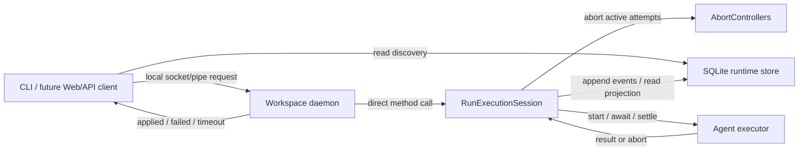

# Runtime Control Abstraction Refactor Roadmap

This document uses a local runtime/API dogfooding incident as the concrete
failure case for refactoring the runtime control abstraction. It is a roadmap
investigation note and future fix record, not current product truth.

## Status

- [x] Incident captured from local dogfooding.
- [x] Immediate cleanup completed: the experimental web/API dev server, current
  daemon process, and `acpx` child processes were stopped.
- [x] The affected run was eventually canceled and the command queue drained.
- [x] Root cause and local daemon control model captured.
- [x] CLI wait semantics captured.
- [x] Focused runtime regression coverage added for daemon active control,
  short-session control, stale inspection, idle-stop, and shutdown.
- [x] Runtime control-command responsiveness implemented through daemon-hosted
  run execution sessions and workspace socket request/response.
- [x] CLI and future Web/API client command feedback distinguish applied,
  failed, and timed-out local daemon responses.
- [ ] Fresh-request retry idempotency needs a precise retry-target convergence
  rule; signal and fork convergence are covered.

## Incident

During local runtime/API dogfooding, the workflow
`.acpus/workflows/adversarial-review/workflow.ts` was started so an experimental
runtime view could observe a live run graph and node inspection state.

The first test run failed because Claude-backed agents required local
authentication. A second run was started with selected agents overridden to
`pi`:

- run id: `2026070322361088B664D63205E83CB667`
- workflow name: `adversarial-review`
- agent overrides: `gamma`, `delta`, and `synthesizer` used `pi`

While this run was active, a cancel command was submitted. The CLI/API returned
a successful control response, but the run remained pending/running in the
runtime state. The experimental runtime view and `doctor` still showed runnable
work and a pending command until manual cleanup and a later daemon tick applied
the cancel.

## Observed Timeline

All timestamps are UTC values from the local runtime DB.

- `2026-07-03T14:36:10.851Z` - run
  `2026070322361088B664D63205E83CB667` created.
- `2026-07-03T14:36:11.200Z` - root and worker frames started.
- `2026-07-03T14:38:05.675Z` - cancel command
  `cmd_25785bd4-75ca-43c2-9cae-c10bb7933eac` created with status `pending`.
- `2026-07-03T14:39:53.657Z` - scheduler still advanced the run and completed
  the `delta` branch after the cancel command had been queued.
- `2026-07-03T14:41:56.810Z` - cancel events appended: the beta attempt,
  worker group, root frame, and run were canceled.
- `2026-07-03T14:41:56.839Z` - cancel command marked `applied` with payload
  `{"status":"canceled"}`.

In the original incident, the final state was internally consistent: the run
became `canceled`, the old pending command queue became empty, and `doctor`
eventually reported no idle-stop blockers. The problem was control-plane
ownership, latency, and misleading feedback, not eventual consistency failure.

## User-Visible Symptoms

- A cancel action appeared to succeed, but the run did not immediately switch to
  `canceled`.
- The run graph continued to show active or runnable work after cancellation.
- The old `doctor` output reported one pending command, one runnable run, and
  idle-stop blocked by both.
- Process inspection showed daemon and `acpx` child processes still present
  while the user expected "stop" to mean no active runtime work.
- The old manual daemon tick output reported `commands: 1`, which was easy to
  misread as "the command was applied" even though a tick could count a command
  that was deferred or swallowed by the daemon loop.

## Original Evidence

The original cancel command was accepted and persisted. The old client
submission path was not the primary failure:

- The experimental web/API command submission path called `applyRunControl`
  through the web server API.
- CLI control commands also called `applyRunControl`.
- `applyRunControl` submitted a durable command and called `applyControlCommand`
  with scheduler advancement disabled.

The old runtime command path then attempted to claim the scheduler run lease. If
the lease could not be claimed, `applySchedulerControlCommandUnchecked`
deferred the command instead of applying it immediately.

The active scheduler execution path held the same run lease while executing
ready agent instances. In this incident, long-running agent work kept the run
lease active while the cancel command waited. The cancel only applied after the
active work was interrupted/stopped and a later tick could claim the run lease.

The daemon loop also contributes to confusing observability:

- the loop heartbeats the daemon lease before entering a runtime tick;
- a runtime tick may spend a long time inside scheduler advancement while
  awaiting agent execution;
- a long tick can make the daemon lease appear stale from the outside;
- the runtime tick catches control-command errors and still increments its
  command counter, so `commands: 1` means "one command was considered", not
  "one command was successfully applied".

## Working Theory

The core issue is control-plane ownership and responsiveness, not client
synchronization.

SQLite is the right durable fact source for runtime state, scheduler events,
recovery, and audit. It is the wrong abstraction for the normal control hot
path. Acpus runs are local; control should naturally reach the local runtime
process that owns active attempts. A DB row can record a control request for
audit or idempotency if that proves useful, but it should not be the message bus
that delivers control to an in-flight run.

Runtime currently couples these concerns too tightly:

- command ingestion;
- command application;
- scheduler advancement;
- long-running agent execution;
- daemon liveness reporting.

Cancel, pause, retry, and signal commands currently compete with active
scheduler advancement for the same scheduler run lease. A command that needs to
interrupt active work waits for the same ownership path that the active work
already holds. This makes operator controls durable, but not responsive under
long-running agent calls.

The needed owner is simple and local: the daemon process should host the
run execution session, and that session should hold active attempt
`AbortController`s. CLI and any future Web/API client should send a local
request to the daemon; the daemon should call the live session and answer when
the control effect has been durably applied or failed. Scheduler run leases and
`ownerEpoch` remain internal store/scheduler fencing details, not a public
control protocol.

## Potential Root Causes

These causes are not mutually exclusive.

1. **Control application competes with execution instead of feeding it.**

   Control commands and active scheduler advancement both require the same run
   lease. While an agent attempt is running, cancel cannot append cancellation
   events unless it can claim that lease. This is the wrong local shape: the
   daemon-hosted run execution session already owns the active abort handles
   and should consume high-priority control intent itself.

2. **Active attempts are only abortable from inside the current advance call.**

   The scheduler has `AbortController`s for active attempts, but external
   control commands do not have a direct way to signal those controllers. A
   cancel intent becomes DB state first; it does not immediately interrupt the
   in-memory agent execution owned by another tick.

3. **Daemon heartbeat is tied to tick progress.**

   The daemon process can be healthy while its daemon lease heartbeat
   looks stale, because the loop is waiting inside a long tick. This can produce
   duplicate-looking daemons or confusing diagnostics.

4. **Command counters hide deferred work.**

   the runtime tick increments `commands` after trying a command, even when
   command application throws or the command is deferred. This weakens both
   diagnostics and operator intuition.

5. **Client success wording is too strong.**

   The control response said "Run canceled" even though the control effect had
   not been applied yet. CLI and future Web/API client feedback should not imply
   state transition completion until the local daemon has applied the effect and
   the durable projection reflects it.

## Target Design Decisions

These decisions replace the candidate wording above and deliberately reject a
distributed control-plane design. Acpus runtime control is local request/response
control over a local workflow executor.

1. **Make the local daemon the control authority.**

   CLI and any future Web/API client control requests should route to the
   workspace daemon. They should not attempt to apply scheduler control directly
   from the submitting process. If the daemon is not running, the client path
   should start or wake it. If the daemon still cannot be reached, the control
   request should fail clearly instead of leaving behind an offline command that
   may never be consumed.

2. **Remove CLI from scheduler ownership.**

   CLI may prepare workflow source, normalize inputs, admit durable run records,
   and observe run projections. It must not advance scheduler work, hold run
   leases, own active attempts, or create `AbortController`s for runtime
   execution.

   Foreground `workflows run` should submit or attach to daemon execution and
   observe until the requested foreground condition is reached. `workflows run
   --background` should return after the daemon has accepted responsibility for
   the admitted run. In both modes, the live execution owner is the daemon-hosted
   `RunExecutionSession`, not the CLI process.

3. **Keep admission before daemon execution.**

   Workflow preparation, input normalization, agent override validation, and
   durable run admission should remain outside daemon execution. The daemon
   should execute only frozen durable runs from SQLite and run-local files.

   This keeps daemon execution independent from live workflow source and avoids
   turning daemon startup into a compiler/catalog/import problem. If CLI
   admission succeeds but daemon handoff fails, the run remains inspectable as a
   durable admitted run whose execution state is inactive or stale, rather than
   partially executing in the CLI process.

4. **Use daemon request/response as the control hot path.**

   The normal path should be:

   ```text
   CLI/client -> local daemon -> RunExecutionSession -> local daemon -> CLI/client
   ```

   A successful control response means the requested effect was applied through
   the live session and persisted to the runtime store. A failed response means
   validation or application failed. A timeout is a client wait failure, not a new
   runtime command state.

5. **Keep the daemon interface small.**

   The first daemon interface should be narrow and behavior-oriented:

   ```ts
   startRun(runId): applied | failed
   control(runId, intent): applied | failed
   observeRun(runId): stream/projection updates
   shutdown(): applied | failed
   status(): daemon status
   ```

   `pause`, `cancel`, `resume`, `retry`, `signal`, and `fork` should use the
   single `control(runId, intent)` interface. Do not create separate daemon
   routes for each control command unless the generic interface proves too weak
   for a concrete local-runtime behavior.

6. **Keep `RunExecutionSession` an in-process daemon module.**

   `RunExecutionSession` is not a distributed actor or public owner protocol. It
   is the daemon's local object for driving one run. It owns the active
   attempt registry, receives control requests, appends scheduler control events
   through existing store fencing, aborts active attempt controllers, and prevents
   late executor results from overwriting control outcomes.

   The external interface should stay small: start or continue a run from
   durable state and apply a control intent for that run. Callers should not
   manage run leases, `ownerEpoch`, heartbeat, command polling, or abort
   controllers.

7. **Keep SQLite out of the control hot path.**

   SQLite remains the durable store for runs, scheduler events, projections,
   recovery, and audit. It should not be the intermediary that delivers normal
   control requests from CLI or future Web/API clients to an active run.

   Delete the existing `commands` table and the command lifecycle entirely. Do
   not replace it with a renamed queue, journal, audit table, or wait table.
   There should be no durable `pending`, `running`, `applied`, or `failed`
   command rows; no `deferCommand`; no stale-command recovery; no command queue
   counts in diagnostics; and no shutdown-by-future-command-consumption path.

   Durable control facts should be represented by run/scheduler events and their
   projections. Request/response control outcomes belong to the daemon response,
   not to SQLite command state.

8. **Keep discovery on durable projections.**

   `runs list`, `runs inspect`, visualization overlays, and other read-only
   discovery APIs should read SQLite projections directly. They should not
   require the daemon to be running and should not start the daemon as a side
   effect.

   This keeps offline history and inspection available after daemon exit, crash,
   or idle stop. If a UI wants live execution metadata such as "daemon currently
   attached" or "active attempt alive", that can be an optional diagnostics
   overlay, not the source of truth for run discovery.

9. **Make inspect a reconciliation view.**

   `runs inspect` should not present SQLite projection status as the whole truth
   for non-terminal runs. It should combine the durable projection with local
   liveness evidence such as daemon heartbeat, daemon pid liveness when
   available, run lease expiry, and active owner metadata.

   Inspect must remain read-only. It may report that a run is stale,
   unattached, or unreconciled, but it should not write recovery events or change
   durable run status. Recovery belongs to daemon start/continue paths.

   CLI output should lead with the intuitive execution state, then include the
   durable last status. For example, a killed run whose projection still says
   `running` should render as:

   ```text
   stale (daemon heartbeat expired, last status: running)
   ```

   This avoids claiming that the run is normally running while also avoiding a
   fabricated terminal state that was never durably recorded.

   The derived execution-state vocabulary should stay small:

   - `active` means a credible daemon/run lease currently owns or can manage the
     non-terminal run;
   - `inactive` means the durable run is non-terminal but no daemon is currently
     attached, and no stale owner is being reported;
   - `stale` means the durable run is non-terminal but the last known execution
     owner is no longer credible, such as an expired daemon heartbeat or expired
     run lease;
   - `terminal` means the durable run status is already `completed`, `failed`,
     or `canceled`;
   - `unknown` means the host cannot determine enough local liveness information
     to classify the run.

   These are inspect/diagnostics states, not durable run statuses.

10. **Make sessions apply local control promptly.**

   If a run already has a live `RunExecutionSession`, the daemon should call
   that session directly. If no live session exists but the run is still
   controllable, the daemon should create or recover one from SQLite and then
   apply the control request through that session. This preserves local control
   responsiveness without letting CLI or future clients become alternate
   scheduler owners.

11. **Split control application from run completion.**

   A control request should not imply the run is complete, idle, or quiescent.
   It asks the local daemon to apply a control effect. Public naming should
   avoid "Run canceled" until the effect is durably applied and the projection
   reflects it.

   CLI `cancel`, `pause`, `resume`, `retry`, `signal`, and `fork` should wait for
   the local daemon response by default. A successful CLI exit means the
   effect was applied. A failed exit means the effect failed or the wait timed
   out. The first pass should not add a `--no-wait` mode.

   The CLI must not wait for the run to become quiescent or terminal after
   command application.

   For forward-progress commands, this distinction is essential:

   - `resume` waits until the pause gate is cleared, not until resumed work
     completes;
   - `retry` waits until retry events are applied, not until retried work
     completes;
   - `signal` waits until the signal payload is consumed, not until downstream
     work completes;
   - `fork` waits until the fork run is created, not until the fork run
     completes.

   CLI waits should have a default timeout of 30 seconds in the first pass.
   Timeout does not create a new runtime state; it reports that application was
   not confirmed within the interactive wait window and includes the run id,
   requested control type, and current run summary.

12. **Keep scheduler fencing internal.**

   The scheduler store may continue using run leases and `ownerEpoch` to protect
   writes. Those details should not become a user-facing or multi-owner control
   protocol. They exist to keep SQLite facts coherent, not to model a
   distributed system.

13. **Daemon heartbeat must not depend on tick completion.**

   A healthy daemon can spend a long time awaiting active agent work.
   Daemon lease heartbeat should continue independently of long run
   execution so diagnostics do not report a live process as stale.

   The first implementation should use a 1 second daemon heartbeat interval and
   a 5 second daemon stale threshold for inspect and local control connectivity.
   If the recorded daemon pid is known dead, inspect may report the daemon/run as
   stale immediately. If pid liveness is unavailable or inconclusive, heartbeat
   age is the deciding signal for whether non-terminal execution is stale or
   unknown.

   This 5 second threshold is only a read/diagnostic/control-connectivity
   threshold. It must not trigger scheduler recovery, run ownership takeover, or
   durable status mutation. Scheduler run lease stale detection remains separate:
   keep the first implementation at the existing conservative 30 second lease
   stale window, and do not lower it below 15 seconds without measured evidence
   that local executor shutdown, filesystem latency, and process scheduling make
   it safe.

14. **Keep daemon lifecycle demand-driven and local.**

   Commands that execute or control work require the daemon. `workflows run` and
   `runs cancel`, `pause`, `resume`, `retry`, `signal`, and `fork` should start
   or wake the workspace daemon when needed, then call `startRun` or
   `control(runId, intent)`. If the daemon cannot be reached after this local
   start/wake attempt, the command should fail clearly and should not leave a
   durable offline command behind.

   Read-only discovery must stay passive. `runs list`, `runs inspect`,
   visualization reads, and read-only diagnostics should read SQLite projections
   directly and must not start the daemon as a side effect.

   Foreground CLI execution is an attach/observe client, not an execution owner.
   Disconnecting a foreground CLI must not kill the daemon-owned run. The daemon
   may idle-stop only after it has no active `RunExecutionSession`s, no attached
   observe clients, and no admitted non-terminal run that is currently runnable
   or otherwise continuable locally.

   The first implementation should use a fixed 30 second idle-stop window.
   Paused runs and signal waits without timeout do not count as continuable work
   for idle-stop purposes; they should allow the daemon to exit after the idle
   window. Signal waits with timeout deadlines are local scheduled work and keep
   the daemon resident until settled.

15. **Keep session control responsive across long awaits.**

   The daemon should host one `RunExecutionSession` per active or recoverable
   run. Different run sessions may make progress concurrently. Within a single
   run session, durable scheduler writes should remain serialized, but long
   agent execution awaits must not hold a session-wide lock that blocks control
   requests.

   `RunExecutionSession` should use a short local commit mutex only around
   SQLite event/projection writes. `cancel` and `pause` should enter the session,
   persist the durable fenced scheduler effect through that short commit path,
   directly abort active attempt controllers, and then return an applied
   response.

   Late executor results must be fenced by attempt identity, owner epoch, and/or
   current projection checks so they cannot overwrite a cancellation, pause, or
   retry decision that was applied while the executor was still returning.

16. **Use a fixed local daemon socket, not stored service discovery.**

   The first daemon API should use a workspace-derived local endpoint: a Unix
   domain socket under `.acpus/.local` on Unix-like hosts and the platform
   equivalent named pipe on Windows. The protocol should be a small stdlib JSON
   request/response protocol for `startRun`, `control`, `observeRun`,
   `shutdown`, and `status`.

   SQLite should not store daemon endpoint, port, auth token, auth token hash, or
   service-discovery data. The socket/pipe path is derived from the workspace,
   so the client does not need durable discovery. If the socket connection
   fails, execution/control commands should start or wake the daemon and retry
   the same local endpoint until the command is applied, failed, or the fixed
   30 second client wait expires.

   Do not introduce an HTTP localhost port for this first control API. A future
   Web/API server, if added, should be another local client of the daemon socket;
   browser code should not connect directly to the daemon.

17. **Keep daemon recovery scoped to runnable or explicitly targeted runs.**

   The daemon is a local execution owner, not a whole-store background repair
   service. `startRun(runId)` must create or recover a session for that specific
   run. Daemon startup may also scan this workspace for admitted non-terminal
   runs that are currently runnable or otherwise continuable and start sessions
   for those runs.

   Runs that are paused, waiting for an external signal, terminal, or otherwise
   have no runnable work should not keep the daemon alive. A later `resume`,
   `signal`, `retry`, or explicit `startRun` can start or wake the daemon and
   recover that targeted run.

   `runs resume <runId>` should start or wake the daemon, recover the targeted
   run session, clear the pause gate, persist the applied effect, and continue
   execution if runnable work becomes available. `runs signal <runId> ...`
   should follow the same shape: start or wake the daemon, recover the targeted
   run session, consume the matching signal wait, persist the applied effect, and
   continue execution if the signal unlocks runnable work.

   Stale durable `running` projections may be reconciled only from daemon
   start/continue/control paths, and only through the normal scheduler lease
   stale rules. Read-only commands such as `runs inspect` must never trigger
   recovery. This keeps discovery passive and prevents daemon startup from
   becoming an unbounded maintenance sweep.

18. **Make controls idempotent through run state, not request tables.**

   The refactor should not introduce a durable request table to replace
   `commands`. Control idempotency belongs in run projection checks and
   scheduler event/commit semantics. The daemon protocol may carry an ephemeral
   request id for logging or tracing, but that id must not become a durable
   command/request state machine.

   Repeated controls should converge on the same applied outcome:

   - `cancel` on an already canceled run returns `applied` without appending
     duplicate cancel events;
   - `pause` on an already paused run returns `applied`;
   - `resume` after the pause gate is already cleared returns `applied`;
   - `retry` uses the target node/attempt and retry intent to derive stable
     scheduler commit identity, so repeated retry requests cannot create
     duplicate retry branches;
   - `signal` uses signal name plus waiting instance identity to consume the
     intended wait exactly once, so a retry after client timeout cannot deliver
     the same signal twice;
   - `fork` derives or records stable fork identity at the scheduler commit
     layer, so repeated fork requests return the same fork run id instead of
     creating multiple fork runs.

   If a CLI client times out and the user retries, the second request should
   observe or complete the same run-state transition. It should not need a
   persisted command row to answer what happened to the first request.

19. **Use socket binding as daemon single-instance arbitration.**

   Keep daemon start/wake simple and local. If multiple CLI clients attempt to
   start or wake the daemon concurrently, they may all spawn a daemon process.
   The fixed workspace socket/pipe bind is the single-instance authority: one
   daemon wins the bind and serves requests.

   A daemon that cannot bind because the socket/pipe already exists should try
   to connect to that endpoint and call `status()`. If a live daemon responds,
   the losing process exits. If the endpoint exists but cannot be connected, the
   process may remove the stale socket and retry bind only when local evidence
   says the recorded daemon is not credible, such as a dead pid or expired
   daemon heartbeat.

   `daemon_lease` should assist stale socket detection, inspect, and diagnostics.
   It must not become a separate leader election, startup lock, or distributed
   ownership protocol. CLI start/wake waits by polling the fixed socket until the
   daemon responds, startup fails clearly, or the fixed 30 second client wait
   expires.

20. **Keep daemon API errors stable and small.**

   The daemon response contract should expose a small set of stable error codes
   for CLI and future Web/API clients. It should not leak scheduler/store
   implementation details such as `lease_lost`, owner epoch mismatch, SQLite
   constraint names, or projection internals as public CLI/API contracts.

   The first public daemon error set should be:

   - `RUN_NOT_FOUND`;
   - `RUN_TERMINAL`;
   - `RUN_NOT_CONTROLLABLE`;
   - `INVALID_CONTROL`;
   - `CONTROL_CONFLICT`;
   - `EXECUTION_UNAVAILABLE`;
   - `STORE_ERROR`;
   - `INTERNAL_ERROR`.

   CLI copy and JSON output should derive from these stable codes plus a concise
   message. Detailed scheduler/store causes should remain available through
   daemon logs and diagnostics so implementation internals can change without
   changing the control-plane contract.

21. **Make foreground CLI signals detach, not control.**

   Foreground `workflows run` is an observe client of daemon-owned execution. It
   should admit the run, start or wake the daemon, call `startRun(runId)`, and
   then observe until the run reaches a terminal durable status. A normal
   foreground completion should use the durable final status to choose the CLI
   exit code.

   User terminal signals must not become implicit runtime controls. On `Ctrl-C`,
   the foreground CLI should detach from observation, print the run id and the
   explicit `runs cancel <runId>` command, and exit without canceling the
   daemon-owned run. Stopping a run requires an explicit control request such as
   `runs cancel <runId>`, which waits for applied/failed/timeout using the normal
   daemon control path.

   Do not add hidden behavior such as "first `Ctrl-C` detaches, second
   `Ctrl-C` cancels" in the first implementation. Implicit terminal-signal
   control would reintroduce ambiguity about which process owns runtime control.

22. **Keep daemon shutdown separate from run control.**

   `shutdown()` is a daemon service lifecycle operation, not a run control. It
   should stop the local daemon only when there are no active
   `RunExecutionSession`s. In that case it returns `applied`, releases local
   daemon resources, and exits without changing any run status.

   If active sessions exist, `shutdown()` should return `failed` with
   `CONTROL_CONFLICT` and tell the client to wait for runs to finish or issue
   explicit run controls such as `runs cancel <runId>`. The first implementation
   should not provide force shutdown. Force-killing the daemon would deliberately
   create stale non-terminal execution and should not be part of the default
   control abstraction.

   Idle-stop is normal daemon exit after no active local work; manual shutdown
   is explicit service management. Neither should cancel, pause, fail, or
   otherwise mutate runs. If a future product needs "stop daemon and cancel all
   runs", that should be an explicit separate command built on per-run controls,
   not a hidden meaning of `shutdown()`.

## Architecture Goal



The diagram has one runtime control authority and one control hot path. SQLite
stores facts and serves read-only discovery; it does not deliver the control
request to the active attempt.

## SQLite Storage Model

Current SQLite schema stores these categories:

- **Schema/versioning:** `schema_migrations`.
- **Daemon liveness:** `daemon_lease` stores workspace daemon diagnostics,
  generation, pid, endpoint/auth metadata, heartbeat, idle window, protocol and
  runtime version metadata. This should be renamed/conceptually replaced by
  daemon lease terminology, and endpoint/auth metadata should be removed.
- **Control queue to delete:** `commands` stores durable control requests,
  statuses, payloads, owner generation, idempotency, and timestamps. This table
  and all command-lifecycle concepts should be removed.
- **Run admission and summary:** `runs` stores run id, name, durable status,
  workflow entry, digests, and timestamps. `run_inputs` stores frozen workflow
  IR, normalized input, agent overrides, lock metadata, output, package lock
  digest, and run directory.
- **Durable event log and idempotency:** `run_events` stores ordered run events
  with payloads and idempotency keys. `scheduler_commits` stores scheduler commit
  idempotency and event digests.
- **Read projections:** `node_states`, `scheduler_frames`, `node_instances`,
  `node_attempts`, `group_members`, and `signal_waits` store static/dynamic run
  projections for list, inspect, visualization, signal waits, retry/fork
  planning, and recovery.
- **Execution metadata and artifacts:** `execution_metadata` stores attempt and
  agent metadata. `artifacts` stores artifact registry rows pointing at
  run-local files.
- **Scheduler fencing:** `run_leases` stores run owner id, owner epoch, lease
  expiry, heartbeat, claim/release timestamps, and reason. It is internal
  scheduler fencing/liveness data, not a public control protocol.

After this refactor, SQLite should store only:

- schema/version metadata;
- daemon lease/liveness metadata under daemon terminology, without endpoint,
  port, auth token, auth token hash, or service-discovery fields;
- admitted run summaries and frozen run inputs;
- durable run/scheduler events and scheduler commit idempotency;
- read projections for discovery, inspect, visualization, retry/fork planning,
  signal waits, and recovery;
- execution metadata and artifact registry rows;
- internal scheduler run leases for fencing and stale-owner detection.

The first implementation slice simplifies SQLite only where it reduces the
control abstraction directly:

- delete `commands` and every command-lifecycle API;
- keep `daemon_lease` as daemon diagnostics, not startup authority;
- narrow daemon lease metadata to local daemon liveness/connectivity and remove
  endpoint/auth-token fields. The daemon socket/pipe path is fixed from the
  workspace under `.acpus/.local` rather than stored in SQLite;
- remove command queue counts from diagnostics and idle-stop blockers.

Do not combine this with a broader projection rewrite. `run_events`,
`scheduler_commits`, `run_leases`, `node_states`, `scheduler_frames`,
`node_instances`, `node_attempts`, `group_members`, `signal_waits`,
`execution_metadata`, and `artifacts` should stay in the first slice unless a
separate, lower-risk design proves one is redundant.

After this refactor, SQLite should not store:

- command rows, command statuses, command payloads, command ownership, command
  diagnostics, or command queue counts;
- any renamed equivalent of a durable control queue;
- control request wait state;
- daemon endpoint, port, auth token, auth token hash, or service-discovery
  fields;
- shutdown requests waiting for future daemon consumption;
- command-named idempotency fields. Idempotency should live at the scheduler
  event/commit layer or in direct daemon request handling without becoming a
  durable queue.

## Legacy Runtime Lesson

The legacy runtime under `legacy/packages/runtime` used a different control
shape. The daemon held live `WorkflowInterpreter` instances, and each
interpreter owned a `RunControl` object with active `AbortController`s,
abort intents, and per-run scheduling guards. HTTP control routes called the
live interpreter directly, so `cancel` and `pause` reached the abort handles
without waiting for a DB command queue.

That legacy approach had good control locality and low interrupt latency, but
its persistence model was per-run JSON files plus atomic rename, and its
correctness relied heavily on a single live daemon/interpreter process. The
new runtime should not return to that storage or ownership model. It should
borrow the colocated control shape while preserving the current durable
SQLite scheduler event log, run leases, `ownerEpoch` fencing, typed store
errors, and recovery behavior.

## Regression Test Shape

A useful test should reproduce the actual coupling and the chosen fix:

- run a foreground `workflows run` path and assert the CLI does not advance
  scheduler work, hold a run lease, own active attempts, or create runtime
  execution abort controllers;
- assert the daemon executes only an admitted frozen run from SQLite/run-local
  files and does not read live workflow source during execution;
- assert foreground run observes daemon-owned execution, while background run
  returns only after daemon acceptance of the admitted run;
- assert CLI/client control commands call the daemon through the single
  `control(runId, intent)` interface rather than per-command routes or direct
  scheduler/store functions;
- create a run with a controlled long-running executable node;
- drive it through a daemon-hosted `RunExecutionSession` so the session
  exposes an active attempt;
- submit cancel through the local daemon while the attempt is still
  running;
- assert the daemon calls the live session without CLI/client trying to become a
  scheduler owner;
- assert the session appends cancel events through existing scheduler fencing;
- assert the active attempt receives abort promptly and late results cannot
  overwrite the canceled projection;
- assert the daemon response is `applied` only after the scheduler projection
  reflects the control effect;
- assert CLI wait exits on that daemon response, not when later runnable work
  completes;
- assert wait timeout reports the run id, control type, and current run summary
  without inventing a new command state;
- assert "daemon unavailable" fails clearly after start/wake is attempted,
  without leaving an offline command queue behind;
- assert `workflows run` and control commands start or wake the daemon before
  calling `startRun` or `control`, while read-only commands such as `runs list`
  and `runs inspect` do not start it;
- assert CLI/client connection uses the workspace-derived local socket/pipe and
  does not read endpoint, port, auth token, or service-discovery data from
  SQLite;
- assert disconnecting a foreground observe client does not cancel or kill the
  daemon-owned run;
- assert daemon idle-stop only happens when there are no active sessions, no
  attached observe clients, and no admitted non-terminal run that is currently
  runnable or otherwise continuable locally;
- assert paused runs and signal waits without timeout allow daemon idle-stop
  after the fixed 30 second idle window, while timed signal waits keep the
  daemon resident until the deadline is settled;
- assert daemon startup recovers only currently runnable/continuable admitted
  non-terminal runs, plus runs explicitly targeted by `startRun` or `control`;
- assert paused runs, signal waits without timeout, terminal runs, and
  non-terminal runs with no runnable work do not keep the daemon alive;
- assert `runs resume <runId>` and `runs signal <runId> ...` start or wake the
  daemon, recover the targeted run session, apply the control effect, and
  continue execution if runnable work is unlocked;
- assert stale durable `running` projections are reconciled only from daemon
  start/continue/control paths through normal scheduler lease stale rules, never
  from read-only `runs inspect`;
- assert repeated `cancel`, `pause`, and `resume` controls return `applied`
  against already-applied run state without appending duplicate events;
- assert repeated `signal` and `fork` controls converge through stable
  scheduler projection/fingerprint identity and cannot duplicate signal
  deliveries or fork runs after a CLI timeout retry;
- assert repeated `retry` controls converge through stable retry-target state
  without creating duplicate retry branches after a CLI timeout retry;
- assert daemon request ids, if present, are ephemeral trace/log values and are
  not persisted as command/request state;
- assert concurrent daemon start/wake attempts converge through fixed
  socket/pipe binding, with losing daemons exiting after `status()` confirms a
  live daemon;
- assert stale socket removal is allowed only when local evidence makes the
  recorded daemon not credible, such as dead pid or expired daemon heartbeat;
- assert `daemon_lease` is not required as a startup lock or leader-election
  protocol and is used only for stale socket detection, inspect, and diagnostics;
- assert daemon error responses use the stable public error set and do not expose
  scheduler/store internals such as `lease_lost`, owner epoch mismatch, SQLite
  constraint names, or projection details as CLI/API contract values;
- assert foreground `workflows run` admits the run, starts or wakes the daemon,
  calls `startRun(runId)`, observes until terminal, and chooses exit code from
  durable final status;
- assert `Ctrl-C` in foreground `workflows run` detaches observation without
  canceling the daemon-owned run, and prints the run id plus explicit
  `runs cancel <runId>` guidance;
- assert stopping a foreground-observed run requires an explicit control request
  through the daemon, not terminal-signal side effects or double-`Ctrl-C`
  behavior;
- assert `shutdown()` succeeds only when there are no active
  `RunExecutionSession`s and does not mutate any run status;
- assert `shutdown()` with active sessions fails with `CONTROL_CONFLICT` and
  guides the user toward explicit per-run controls instead of force-killing the
  daemon;
- assert idle-stop and manual shutdown are daemon lifecycle exits, not implicit
  cancel/pause/fail controls for runs;
- assert a control request can enter a `RunExecutionSession` while that session
  is awaiting long-running agent work, and is not blocked behind the agent await;
- assert session-local durable writes are serialized by a short commit mutex, but
  the mutex is not held while awaiting executor completion;
- assert late executor results are fenced by attempt identity, owner epoch, or
  projection state and cannot overwrite an already applied cancel, pause, or
  retry decision;
- assert diagnostics distinguish applied and failed control processing from a
  request that has not received a daemon response.
- create an unreconciled run whose durable projection is `running` while daemon
  heartbeat or run lease liveness is stale;
- assert `runs inspect` reports a stale execution state such as
  `stale (daemon heartbeat expired, last status: running)` without mutating the
  durable run status or appending recovery events.
- assert the derived execution-state values stay limited to `active`,
  `inactive`, `stale`, `terminal`, and `unknown`, and are not persisted as run
  statuses.
- assert daemon stale classification uses the 5 second daemon heartbeat
  threshold or immediate dead-pid evidence, while scheduler recovery/takeover
  still waits for the separate run lease stale window.

The seam should be in runtime/scheduler tests, not future WebUI tests. Once a
WebUI exists, WebUI tests can verify display behavior against the same daemon
control response state.

## Resolved Questions

- Cancel and pause should be local daemon control requests that the live run
  execution session consumes promptly. They should not be applied by CLI/client
  code that directly competes for scheduler ownership.
- CLI must be removed from scheduler ownership. Foreground run observes daemon
  execution; background run returns after daemon acceptance. Neither mode should
  advance scheduler work in the CLI process.
- Workflow preparation and durable admission remain before daemon execution; the
  daemon executes frozen durable runs and does not read live workflow source.
- The daemon interface starts with `startRun`, `control`, `observeRun`,
  `shutdown`, and `status`; run controls use `control(runId, intent)` rather than
  per-command daemon routes.
- The in-memory abort channel belongs to the daemon-hosted
  `RunExecutionSession`, not CLI, future Web/API clients, the scheduler store,
  or the agent executor.
- The `commands` table should be deleted entirely and not replaced by a renamed
  queue, journal, audit table, or wait table.
- The first SQLite simplification slice should delete `commands`, rename and
  narrow daemon liveness storage, and remove command queue diagnostics; it should
  not rewrite event log, projection, artifact, or run-lease storage.
- `runs list`, `runs inspect`, and visualization reads use durable SQLite
  projections and do not require or start the daemon.
- `runs inspect` should be a read-only reconciliation view that surfaces stale
  live execution, for example
  `stale (daemon heartbeat expired, last status: running)`, instead of
  presenting stale durable `running` as normal execution.
- Derived execution-state values are limited to `active`, `inactive`, `stale`,
  `terminal`, and `unknown`; they are not durable run statuses.
- Public control outcomes should stay minimal: applied, failed, or client wait
  timed out. Do not add an operator-cancel-requested run status solely to reflect
  submitted intent.
- CLI control waits for local daemon application, not run terminal state.
- The first pass should not add `--no-wait` for CLI control commands.
- Future Web/API control clients should use the same daemon response semantics as
  CLI. Their requests should wait for applied, failed, or timeout outcomes while
  UI rendering remains non-blocking.
- `deferred`, `blockedReason`, and owner/applying metadata should not be added
  unless a concrete local-runtime failure mode proves they are needed.
- Daemon heartbeat should be independent from long execution ticks.
- Daemon heartbeat should run every 1 second. `runs inspect` may classify
  non-terminal execution as stale after 5 seconds of missing daemon heartbeat, or
  immediately when the recorded daemon pid is known dead.
- The 5 second daemon stale threshold is not a scheduler recovery threshold.
  Scheduler run lease stale detection should remain 30 seconds in the first
  implementation and should not be lowered below 15 seconds without evidence.
- CLI control wait timeout should default to 30 seconds in the first pass.
- The first implementation should not expose CLI timeout configuration. Do not
  add a `--timeout` option or project/user runtime setting until a concrete
  local workflow proves the fixed 30 second interactive wait is insufficient.
- Execution/control commands start or wake the daemon when needed; read-only
  discovery commands never start it.
- Foreground CLI execution is only attach/observe. CLI disconnect does not kill
  the daemon-owned run.
- Daemon idle-stop is allowed only when there are no active sessions, no
  attached observe clients, and no admitted non-terminal run that is currently
  runnable or otherwise continuable locally.
- The first implementation should use a fixed 30 second daemon idle-stop window.
- Paused runs and signal waits without timeout allow daemon idle-stop; they do
  not keep the daemon resident solely because future input may resume them.
- Signal waits with timeout deadlines keep the daemon resident until the timeout
  is durably settled.
- Daemon recovery is scoped to runnable/continuable admitted runs at startup and
  runs explicitly targeted by `startRun` or `control`. It is not a whole-store
  repair sweep.
- Paused runs, signal waits without timeout, terminal runs, and non-terminal
  runs with no runnable work should not keep the daemon alive.
- `runs resume <runId>` and `runs signal <runId> ...` start or wake the daemon,
  recover the targeted run session, apply the requested effect, and continue
  execution if runnable work is unlocked.
- Stale durable `running` projections may be reconciled only from daemon
  start/continue/control paths through normal scheduler lease stale rules.
  `runs inspect` remains read-only and never triggers recovery.
- Control idempotency belongs in run projection checks and scheduler
  event/commit semantics, not a durable request table.
- Repeated `cancel`, `pause`, and `resume` should return `applied` when the run
  state already reflects the requested effect, without duplicate events.
- Repeated `signal` and `fork` controls converge through stable
  projection/fingerprint identity, so client timeout retries cannot create
  duplicate signal deliveries or duplicate fork runs.
- Repeated `retry` controls still need a precise stable retry-target identity
  rule before they can safely converge across fresh request ids without hiding
  invalid retry attempts.
- Daemon request ids may exist only for ephemeral logging/tracing and must not be
  persisted as command/request state.
- Daemon single-instance arbitration should be the fixed socket/pipe bind. Do
  not add a separate startup lock, leader election, or distributed ownership
  protocol.
- Concurrent daemon start/wake attempts may spawn multiple processes; losing
  daemons should call `status()` on the fixed endpoint and exit when a live
  daemon responds.
- `daemon_lease` assists stale socket detection, inspect, and diagnostics only.
  It is not startup authority.
- Daemon API errors should be limited to stable public codes:
  `RUN_NOT_FOUND`, `RUN_TERMINAL`, `RUN_NOT_CONTROLLABLE`, `INVALID_CONTROL`,
  `CONTROL_CONFLICT`, `EXECUTION_UNAVAILABLE`, `STORE_ERROR`, and
  `INTERNAL_ERROR`.
- Scheduler/store details such as `lease_lost`, owner epoch mismatch, SQLite
  constraint names, and projection internals should stay in daemon logs and
  diagnostics, not CLI/API contract values.
- Foreground `workflows run` observes daemon-owned execution until terminal and
  uses durable final status for the CLI exit code.
- `Ctrl-C` in foreground `workflows run` detaches observation and must not cancel
  the daemon-owned run. The CLI should print the run id and explicit
  `runs cancel <runId>` guidance.
- Do not add hidden terminal-signal control such as double-`Ctrl-C` cancel in
  the first implementation.
- `shutdown()` is daemon service lifecycle, not run control. It should succeed
  only when there are no active `RunExecutionSession`s and must not mutate run
  status.
- `shutdown()` with active sessions should fail with `CONTROL_CONFLICT`; the
  first implementation should not add force shutdown.
- Idle-stop and manual shutdown must not cancel, pause, fail, or otherwise
  mutate runs.
- Each active or recoverable run should have one daemon-hosted
  `RunExecutionSession`; different run sessions may progress concurrently.
- `RunExecutionSession` must not hold a session-wide lock while awaiting agent
  execution. Control requests must be able to enter the session during long
  executor awaits.
- Durable writes within one run session should be serialized by a short commit
  mutex, and late executor results must be fenced so they cannot overwrite
  applied control outcomes.
- The first daemon API should use a workspace-derived Unix domain socket or
  Windows named pipe with a small stdlib JSON request/response protocol.
- SQLite should not store daemon endpoint, port, auth token, auth token hash, or
  service-discovery fields. The fixed local socket/pipe path is the discovery
  mechanism.
- Do not introduce an HTTP localhost port for the first daemon control API.
  Future Web/API servers should be daemon socket clients, not alternate runtime
  control authorities.

## Remaining Questions

- None currently.

## Non-Goals

- This roadmap does not implement or change the future WebUI design direction.
- This roadmap does not propose direct SQLite access from future web code.
- This roadmap does not propose an HTTP localhost daemon control API.
- This roadmap does not propose an offline durable command queue for future
  daemon consumption.
- This roadmap does not require introducing compatibility behavior for old
  runtime semantics.
- This roadmap does not treat the observed incident as a data-loss issue; the
  final persisted state was internally consistent.
