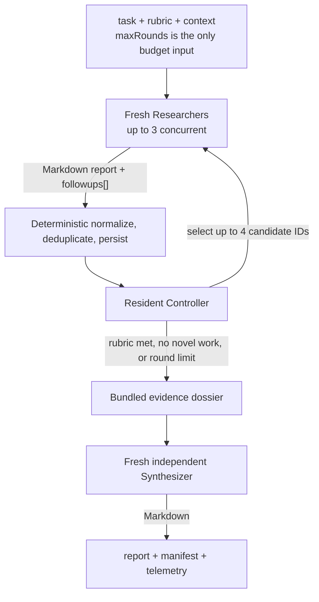

# RLM Frontier

RLM Frontier performs bounded, evidence-driven investigation using a recursive
language-model pattern. Instead of fixing every subtask before execution, it
investigates the current frontier, discovers material follow-up questions from
the evidence, and lets a controller decide whether another round is worthwhile.
Deterministic Tasks enforce deduplication, the round limit, and fixed branching,
frontier, and concurrency policy.

Use it for open-ended work whose decomposition depends on what the investigation
finds, including:

- cross-module diagnosis and causal tracing;
- architecture, security, or implementation review;
- incident analysis and competing-hypothesis evaluation;
- multi-document research and evidence-based decisions.

## Flow



## Agents

The workflow declares three independently configurable Agent slots:
* `researcher`: Return a natural-language evidence report plus follow-up task strings consumed by deterministic deduplication. Multiple Researchers may run in parallel.
* `controller`: Return a natural-language review plus candidate IDs consumed by frontier selection.
* `synthesizer`: Read the dossier and return the complete final Markdown report directly.

## Inputs

| Input | Required | Default | Type | Purpose |
|---|---:|---:|---:|---|
| `task` | Yes | — | String | Root question, diagnosis, review, or decision to complete. |
| `rubric` | Yes | — | String | Evidence, coverage, output-quality, and completion requirements used by the Controller and Synthesizer. |
| `context` | No | `""` | String | Repository scope, constraints, background, exclusions, and useful starting points. |
| `maxRounds` | No | `3` | Number | Round budget checked after each completed evidence-discovery round. This is the only public coverage/cost/latency knob. |

## Outputs

- `dossier`: cumulative Markdown evidence from all completed rounds;
- `report`: final Markdown answer written directly from the Synthesizer;
- `manifest`: JSON record of effective limits, artifact references, and run metrics;
- `rounds`, `processed`, and `pruned`: frontier accounting;
- `selectionErrors`: rejected duplicate or unknown Controller candidate IDs;
- `stopReason`: why recursive research ended.

## Run

Run from the repository or document workspace the Agents should inspect:

```sh
acpus workflow run /absolute/path/to/rlm-frontier/workflow.ts \
  --input '{"task":"Investigate this system","rubric":"Use exact evidence"}'
```

Apply Agent overrides from a JSON file when needed:

```sh
acpus workflow run /absolute/path/to/rlm-frontier/workflow.ts \
  --input input.json \
  --agents agents.json
```
